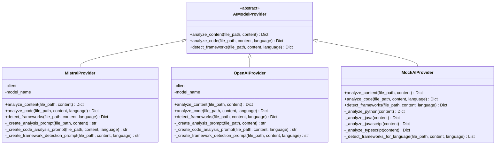
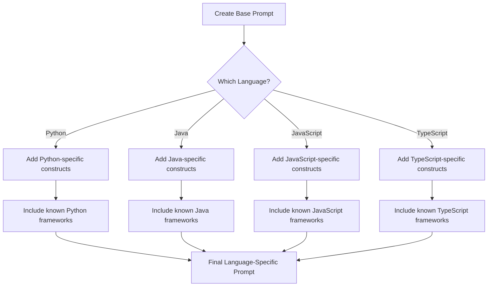
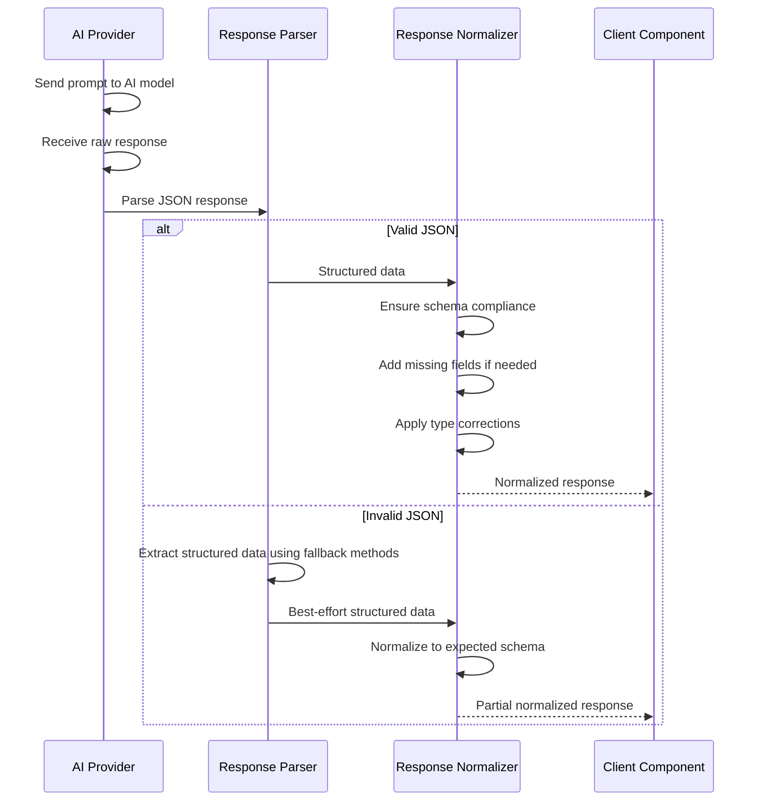
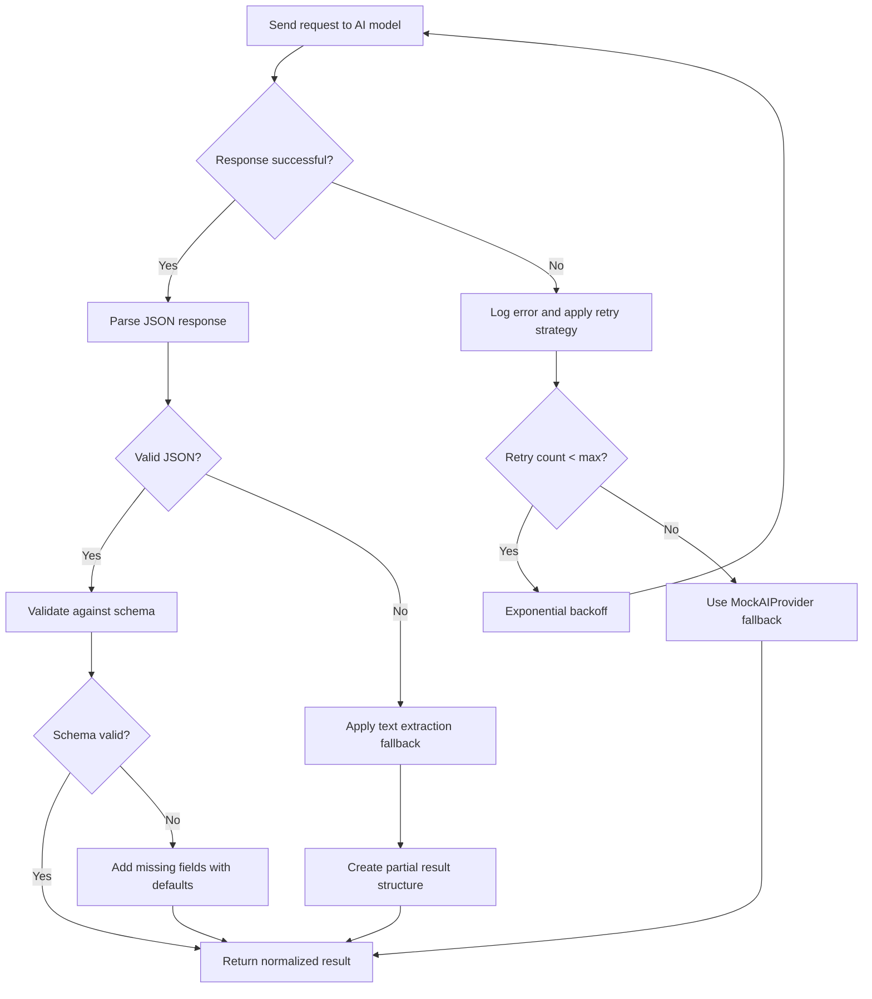
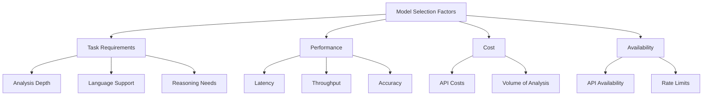
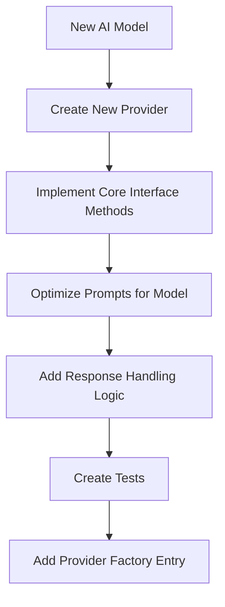

# AI Integration Design Document

This document provides a detailed explanation of how AI models are integrated into the File Analyzer system, including the provider architecture, prompt engineering, and response handling.

## 1. AI Provider Architecture

The system uses a flexible provider architecture to integrate with different AI models:

### 1.1 Provider Interface Design



**Key Aspects of the Provider Architecture:**

1. **Abstract Interface**: The `AIModelProvider` defines a common interface that all providers must implement.

2. **Core Capabilities**:
   - `analyze_content()`: General-purpose file analysis
   - `analyze_code()`: Specialized code structure extraction
   - `detect_frameworks()`: Framework and library detection

3. **Model-Specific Implementations**:
   - Each provider implements these methods using its specific AI model.
   - Providers handle model-specific prompt engineering and response parsing.

4. **Mock Provider**:
   - The `MockAIProvider` implements rule-based analysis without requiring an actual AI model.
   - Useful for testing, development, and fallback scenarios.

5. **Provider Selection**:
   - The system can be configured to use different providers based on requirements.
   - Providers can be swapped without changing the overall system behavior.

## 2. Prompt Engineering

Each provider carefully crafts prompts to obtain structured, consistent results from AI models:

### 2.1 Prompt Types

#### 2.1.1 File Analysis Prompt

```
Analyze this file and provide metadata about it in JSON format.

File path: {file_path}
File content: 
```
{content}
```

Determine the following:
1. File type (code, configuration, documentation, etc.)
2. Programming language (if applicable)
3. Purpose of this file in a software project
4. Key characteristics for documentation

Respond ONLY with a JSON object with these keys:
{
    "file_type": string,
    "language": string,
    "purpose": string,
    "characteristics": list[string],
    "confidence": float (0-1)
}
```

#### 2.1.2 Code Analysis Prompt

```
Analyze this {language} code file and extract its structure in JSON format.

File path: {file_path}
Code content: 
```{language}
{content}
```

Extract the following structural elements:
1. All imports and external dependencies
2. Classes with their methods and properties
3. Functions (parameters and purpose)
4. Variables and constants
5. {language}-specific constructs ({language_constructs})

For each element, extract documentation if available (docstrings, comments).

Respond ONLY with a JSON object matching this exact schema:
{
    "structure": {
        "imports": [list of import statements],
        "classes": [
            {
                "name": "class name", 
                "methods": ["list of method names"],
                "properties": ["list of property names"],
                "documentation": "class docstring or comment"
            }
        ],
        "functions": [
            {
                "name": "function name",
                "parameters": ["list of parameter names"],
                "documentation": "function docstring or comment"
            }
        ],
        "variables": [
            {
                "name": "variable name", 
                "scope": "module/class/function"
            }
        ],
        "language_specific": {
            "key features specific to {language}": []
        },
        "confidence": float (0-1)
    }
}

Ensure your analysis is accurate and thorough. This will be used for documentation generation.
```

#### 2.1.3 Framework Detection Prompt

```
Analyze this {language} code file and identify frameworks or libraries in use.

File path: {file_path}
Code content: 
```{language}
{content}
```

Identify all frameworks and libraries used in this code (such as {known_frameworks}).
Look for import statements, specialized syntax, framework-specific patterns, and architecture.
For each framework detected, provide:
1. Name of the framework
2. Confidence level (0.0 to 1.0)
3. Evidence of usage (imports, patterns, etc.)
4. Features being used from the framework

Respond ONLY with a JSON object matching this exact schema:
{
    "frameworks": [
        {
            "name": "framework name",
            "confidence": float (0-1),
            "evidence": ["list of evidence that led to detection"],
            "features": ["list of framework features being used"]
        }
    ],
    "confidence": float (0-1)
}

If no frameworks are detected, return an empty frameworks array.
```

### 2.2 Language-Specific Customization

Prompts are customized based on the programming language being analyzed:



**Language-Specific Customizations:**

1. **Python**:
   - Focus on imports, classes, decorators, and docstrings
   - Include known frameworks like Django, Flask, FastAPI, etc.
   - Look for specific file patterns (e.g., `settings.py` for Django)

2. **Java**:
   - Focus on packages, imports, annotations, and Javadoc comments
   - Include known frameworks like Spring, Hibernate, Jakarta EE, etc.
   - Look for annotation patterns like `@Controller`, `@Entity`, etc.

3. **JavaScript**:
   - Focus on imports/requires, classes, arrow functions, and JSX
   - Include known frameworks like React, Angular, Vue, Express, etc.
   - Look for framework-specific syntax like React hooks or JSX patterns

4. **TypeScript**:
   - Include all JavaScript considerations plus types, interfaces, and generics
   - Add TypeScript-specific frameworks like NestJS
   - Look for type annotations and declarations

## 3. Response Handling

The system uses a sophisticated approach to handle AI model responses:

### 3.1 Response Processing Flow



**Key Aspects of Response Handling:**

1. **JSON Parsing**:
   - AI responses are expected in JSON format for consistent parsing.
   - Robust error handling catches malformed JSON responses.

2. **Schema Validation**:
   - Responses are validated against expected schemas.
   - Missing fields are added with default values.
   - Type corrections are applied where needed.

3. **Fallback Extraction**:
   - If JSON parsing fails, text-based extraction is attempted.
   - Pattern matching extracts key information from unstructured responses.

4. **Confidence Scoring**:
   - Each response includes confidence scores for the overall analysis.
   - Individual elements may have their own confidence scores.

5. **Result Normalization**:
   - Different AI models may return varying formats.
   - All responses are normalized to a common structure for consistent consumption.

### 3.2 Error Handling Strategy



**Error Handling Strategies:**

1. **API Errors**:
   - Network errors trigger retries with exponential backoff.
   - After maximum retries, fall back to rule-based analysis.

2. **Response Parsing**:
   - JSON parsing errors trigger text-based extraction.
   - Partial results are better than no results.

3. **Schema Validation**:
   - Missing fields are added with appropriate defaults.
   - Type mismatches are corrected when possible.

4. **Confidence Thresholds**:
   - Results below confidence thresholds trigger additional verification or fallback methods.
   - Rule-based results may supplement or replace low-confidence AI results.

5. **Logging**:
   - All errors and unusual responses are logged for monitoring and improvement.
   - Logging includes prompt and response details for debugging.

## 4. AI Model Selection and Configuration

The system supports multiple AI models with different characteristics:

### 4.1 Supported Models

| Provider | Models | Strengths | Considerations |
|----------|--------|-----------|----------------|
| Mistral | mistral-tiny<br>mistral-small<br>mistral-medium | Strong code understanding<br>Structured JSON output<br>Lower latency | Limited context window<br>May require specialized prompts |
| OpenAI | gpt-3.5-turbo<br>gpt-4 | Excellent code analysis<br>Strong reasoning<br>Comprehensive framework knowledge | Higher latency<br>Potentially higher cost<br>Rate limits |
| Mock | Rule-based | No API dependency<br>Consistent results<br>Zero latency | Limited analysis depth<br>Rule-based only<br>No reasoning capabilities |

### 4.2 Model Selection Factors



**Selection Guidance:**

1. **For Development and Testing**:
   - Use `MockAIProvider` for rapid iteration without API costs
   - Predictable responses for automated testing

2. **For Production with Cost Sensitivity**:
   - Use `MistralProvider` with smaller models for routine analysis
   - Reserve more powerful models for complex code analysis

3. **For Maximum Accuracy**:
   - Use `OpenAIProvider` with latest models
   - Appropriate when analysis quality is paramount

4. **For Offline or Restricted Environments**:
   - Use `MockAIProvider` with extended rule sets
   - Consider adding locally-hosted models in future versions

## 5. Future AI Enhancements

The AI integration architecture is designed for future enhancements:

### 5.1 Planned Improvements

1. **Specialized Language Models**:
   - Add support for code-specific models like CodeLlama
   - Integrate models fine-tuned for specific programming languages

2. **Enhanced Prompting Techniques**:
   - Implement chain-of-thought prompting for complex analysis
   - Add few-shot examples for improved accuracy

3. **Streaming Responses**:
   - Support streaming API responses for large file analysis
   - Process analysis incrementally for better UX

4. **Multimodal Analysis**:
   - Add support for analyzing diagrams and documentation images
   - Extract information from mixed code and visual elements

5. **Local Model Support**:
   - Add provider for locally-hosted models (e.g., Ollama)
   - Support for quantized models on lower-powered hardware

### 5.2 Integration Patterns for New Models



**Implementation Steps:**

1. Create a new provider class implementing the `AIModelProvider` interface
2. Implement the core methods with model-specific API calls
3. Optimize prompts for the specific capabilities of the model
4. Add specialized response handling for the model's output format
5. Create comprehensive tests with both successful and error cases
6. Add the provider to the factory for easy configuration

## 6. Conclusion

The AI integration architecture of the File Analyzer system provides a flexible, robust framework for leveraging AI models to analyze code repositories. Key strengths include:

1. **Abstraction**: The provider interface abstracts away model-specific details.
2. **Flexibility**: Multiple AI models can be integrated without changing the core system.
3. **Robustness**: Comprehensive error handling ensures reliable operation.
4. **Optimization**: Careful prompt engineering maximizes AI model effectiveness.
5. **Extensibility**: New AI models can be added with minimal changes.

This architecture ensures the system can evolve with AI technology while maintaining a consistent, reliable interface for the rest of the application.