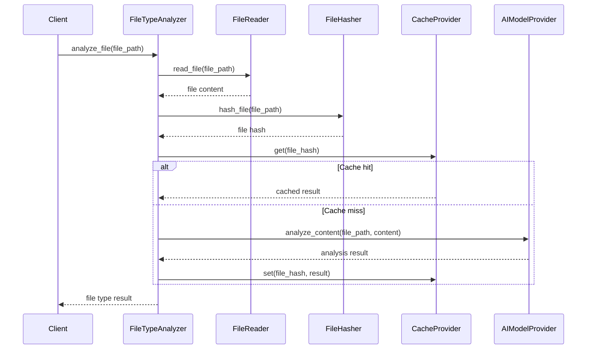
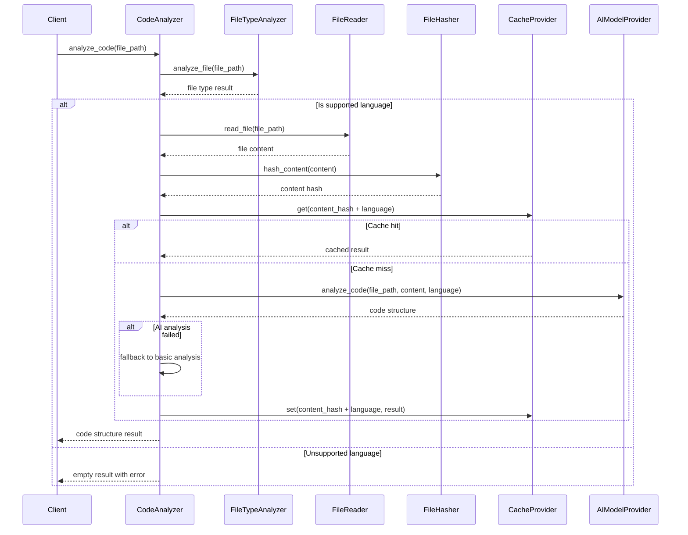
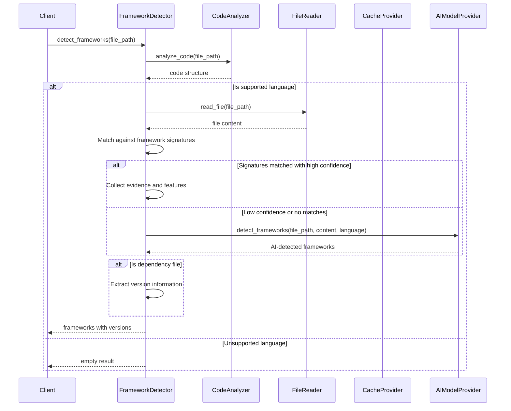
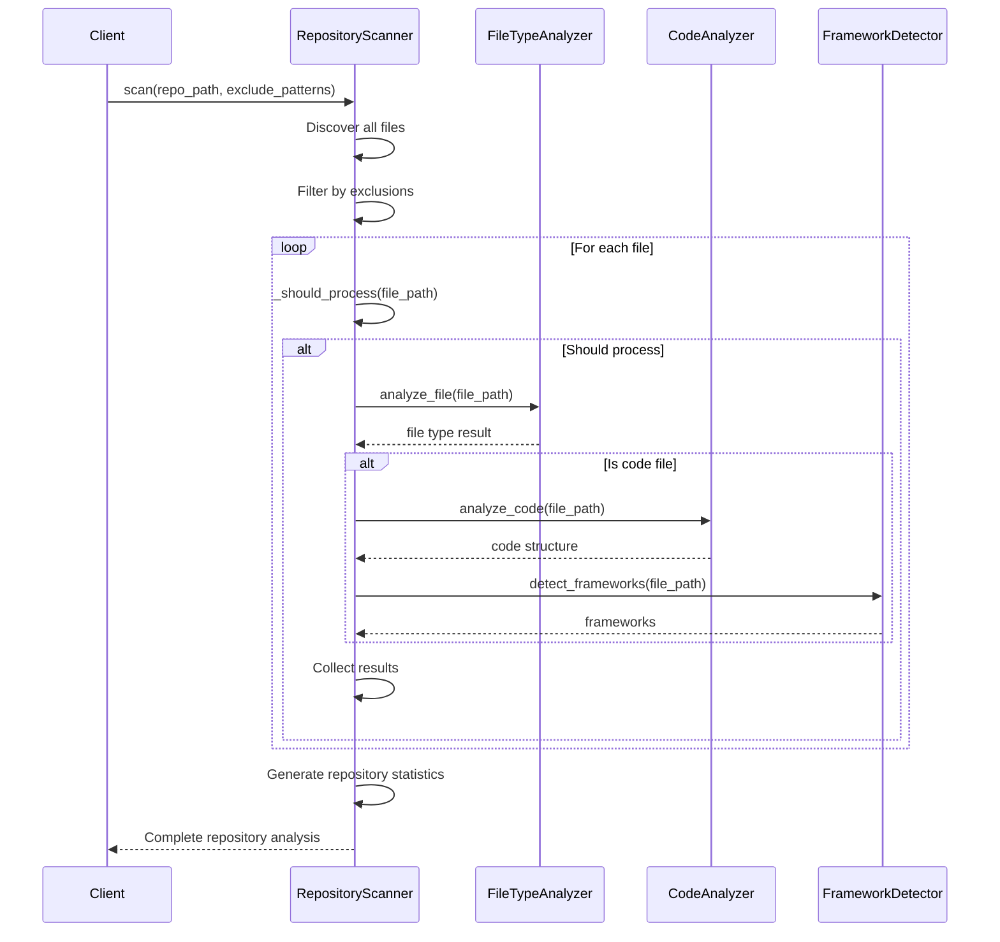
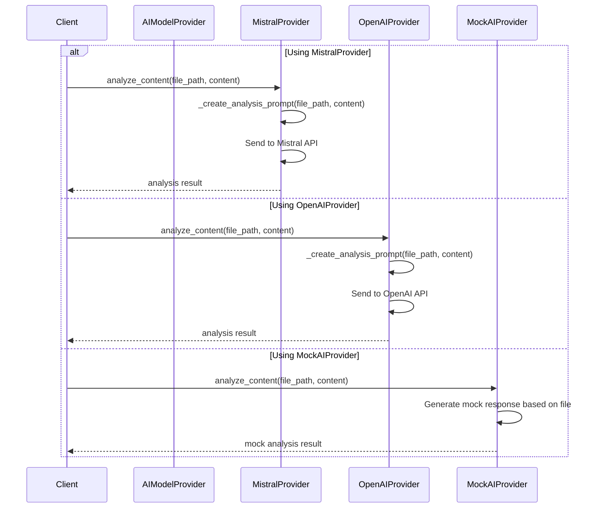
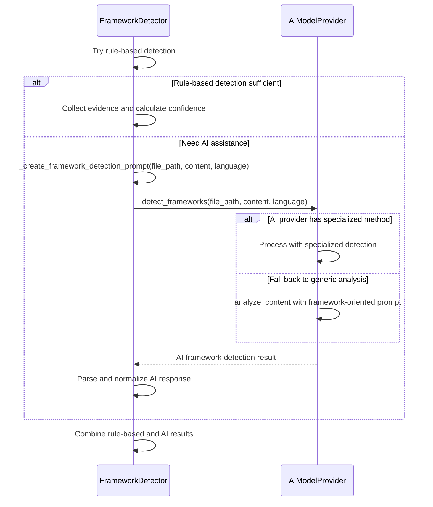
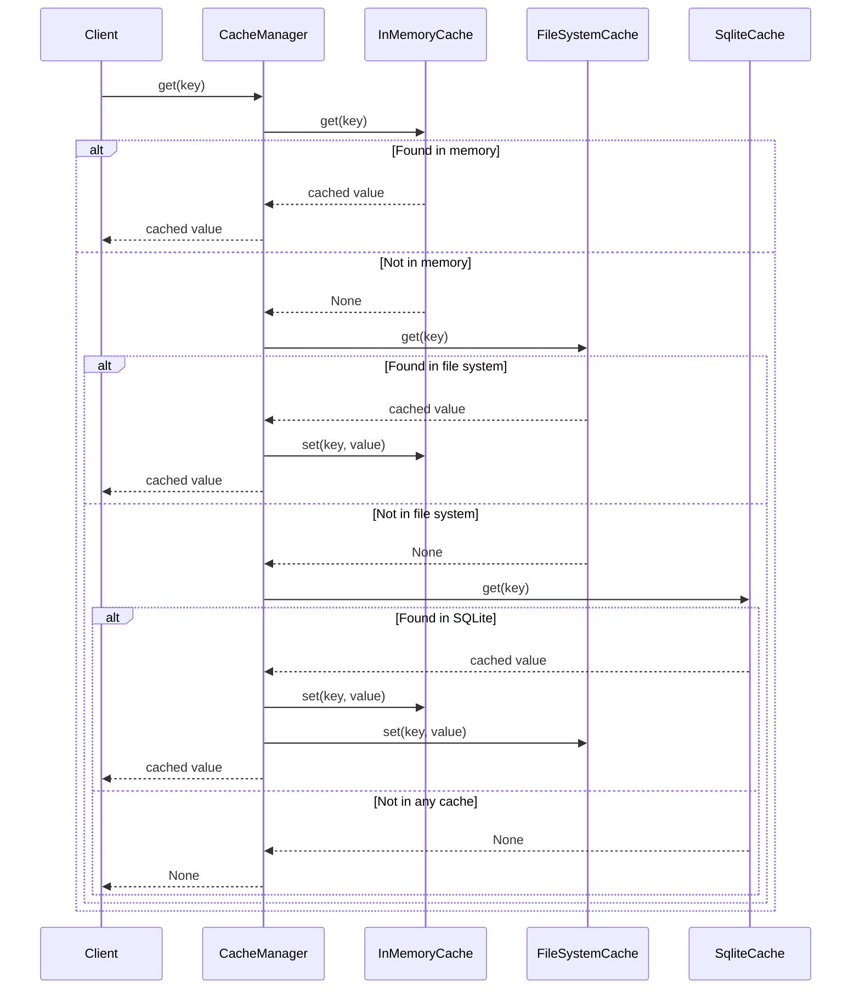
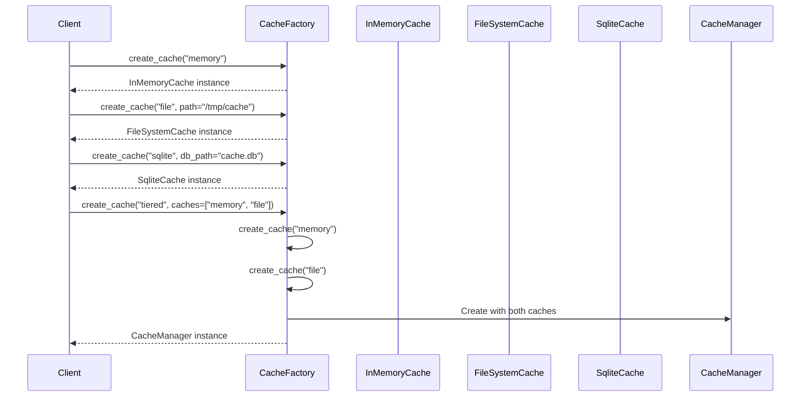
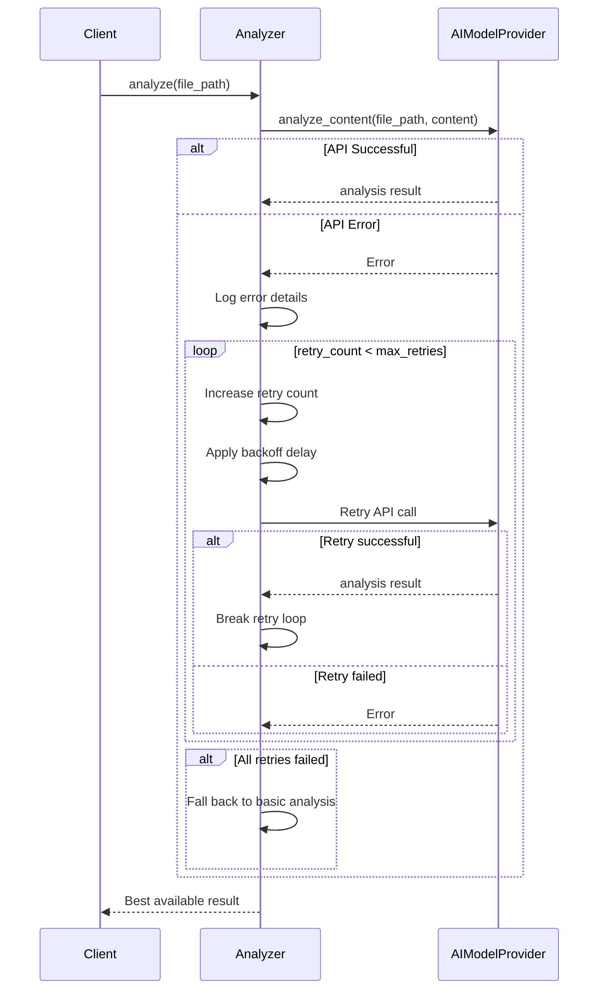

# Component Interactions Design Document

This document focuses on the detailed interactions between components in the File Analyzer system, providing sequence diagrams and explanations for key workflows.

## 1. Core Component Interactions

### 1.1 File Type Analysis Process

**Explanation:**

1. The client requests file analysis by calling `analyze_file()` with a file path.
2. The FileTypeAnalyzer reads the file content using the FileReader.
3. The file is hashed to create a unique identifier for caching.
4. The cache is checked for an existing analysis result using the file hash.
5. If the result is found in cache (cache hit), it's returned immediately.
6. If not (cache miss), the content is sent to the AI provider for analysis.
7. The AI result is cached for future use and returned to the client.

This approach optimizes performance by avoiding redundant analysis of unchanged files and reduces API costs when using external AI services.

### 1.2 Code Analysis Process

**Explanation:**

1. The client requests code analysis for a specific file.
2. The CodeAnalyzer first determines the file type and language using the FileTypeAnalyzer.
3. If the language is supported, the file content is read and hashed.
4. The cache is checked for an existing code analysis result.
5. If found, the cached result is returned.
6. If not, the content is sent to the AI provider for specialized code analysis.
7. If AI analysis fails, the system falls back to basic analysis methods.
8. The result is cached and returned to the client.

This workflow allows for detailed structural analysis of code files while maintaining efficiency through caching and graceful fallback mechanisms.

### 1.3 Framework Detection Process

**Explanation:**

1. The client requests framework detection for a file.
2. The FrameworkDetector first obtains the code structure from the CodeAnalyzer.
3. For supported languages, it reads the file content.
4. The content is matched against known framework signatures.
5. If signatures are matched with high confidence, evidence and features are collected.
6. If confidence is low or no matches are found, AI-based detection is used as a fallback.
7. If the file is a dependency file (like requirements.txt or package.json), version information is extracted.
8. The combined results are returned to the client.

This hybrid approach combines the speed and reliability of rule-based detection with the flexibility of AI-based analysis when needed.

### 1.4 Repository Scanning Process

**Explanation:**

1. The client initiates a repository scan with a repository path and exclusion patterns.
2. The RepositoryScanner discovers all files in the repository and filters out excluded files.
3. For each file that should be processed:
   - It determines the file type using the FileTypeAnalyzer.
   - For code files, it performs code analysis and framework detection.
   - Results are collected for the final report.
4. Repository-wide statistics are generated.
5. The complete analysis is returned to the client.

This approach allows for comprehensive repository analysis while skipping files that don't need detailed analysis, such as binary files or files in excluded directories.

## 2. AI Provider Interactions

### 2.1 AI Provider Strategy Pattern

**Explanation:**

The system implements the Strategy Pattern for AI providers, allowing different AI services to be used interchangeably:

1. All providers implement the same AIModelProvider interface.
2. Each provider has its own implementation of the core methods.
3. The MistralProvider and OpenAIProvider connect to external AI services.
4. The MockAIProvider generates rule-based responses without external API calls, useful for testing and development.
5. Clients interact with providers through the common interface, remaining agnostic of the specific implementation.

This design allows the system to be easily extended with new AI providers while maintaining consistent interaction patterns.

### 2.2 Framework Detection with AI

**Explanation:**

This diagram shows the interaction between the FrameworkDetector and AIModelProvider for framework detection:

1. The FrameworkDetector first attempts rule-based detection using predefined signatures.
2. If the rule-based approach doesn't provide sufficient confidence, AI assistance is requested.
3. A specialized framework detection prompt is created.
4. If the AI provider has a specialized framework detection method, it's used.
5. Otherwise, a generic analysis with a framework-oriented prompt is used.
6. The AI response is parsed and normalized to match the expected format.
7. Rule-based and AI results are combined for the final output.

This hybrid approach leverages the strengths of both rule-based and AI-based detection methods.

## 3. Cache System Interactions

### 3.1 Multi-level Caching

**Explanation:**

This diagram illustrates the tiered caching system implemented by the CacheManager:

1. When a client requests a cached value, the CacheManager checks the fastest cache first (InMemoryCache).
2. If the value is found, it's returned immediately.
3. If not, the next cache level is checked (FileSystemCache).
4. If found at this level, the value is also stored in the faster cache for future access.
5. If still not found, the final cache level is checked (SqliteCache).
6. When found at this level, the value is propagated to all faster caches.
7. If the value is not found in any cache, None is returned.

This approach optimizes cache access by keeping frequently accessed items in the fastest cache while maintaining persistence for less frequent items.

### 3.2 Cache Factory Pattern

**Explanation:**

The CacheFactory implements the Factory Method pattern to create different cache implementations:

1. Clients request a specific cache type from the factory.
2. The factory creates and returns the appropriate implementation.
3. Additional parameters can be passed for specific cache types.
4. For a tiered cache, the factory creates multiple cache instances and combines them in a CacheManager.

This pattern centralizes cache creation logic and allows clients to remain agnostic of the specific implementation details.

## 4. Error Handling and Recovery

### 4.1 AI Analysis Error Recovery

**Explanation:**

This diagram illustrates the error handling and recovery process for AI API failures:

1. When an API call fails, the system logs the error details.
2. The system attempts to retry the call up to a maximum number of retries.
3. Each retry uses an exponential backoff strategy to avoid overwhelming the API.
4. If a retry succeeds, the system proceeds with the successful result.
5. If all retries fail, the system falls back to basic analysis methods.
6. The best available result is returned to the client, ensuring the system degrades gracefully.

This approach provides resilience against temporary API failures and ensures the system can continue to function even when external services are unavailable.

## 5. Conclusion

The component interactions in the File Analyzer system demonstrate a well-structured, modular architecture that emphasizes:

1. **Clear Separation of Concerns**: Each component has specific responsibilities.
2. **Flexible Integration**: Components interact through well-defined interfaces.
3. **Performance Optimization**: Caching and efficient processing reduce resource usage.
4. **Graceful Degradation**: The system can continue functioning even when some components fail.
5. **Extensibility**: New components can be added without modifying existing ones.

These design choices create a robust, maintainable system that can evolve to meet future requirements while providing reliable performance and accurate results.