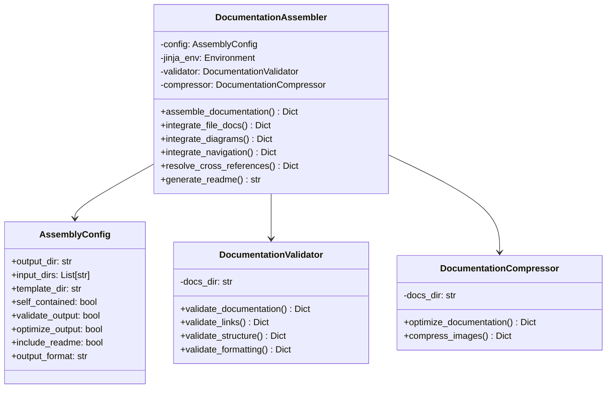

# Documentation Final Assembly System

## Overview

The Documentation Final Assembly system is the last step in the documentation generation pipeline, 
responsible for integrating all documentation components into a complete, cohesive package. It resolves 
cross-references, validates document integrity, optimizes for size, and provides a structure that is easy 
to navigate and use.

## Goals

1. Assemble all documentation components into a unified structure
2. Resolve cross-references between documentation files
3. Validate documentation integrity and completeness
4. Optimize documentation size for deployment
5. Generate navigational aids like README and table of contents
6. Create a self-contained documentation package

## SOLID Design Principles Application

### Single Responsibility Principle
- **AssemblyConfig**: Handles configuration options for the assembly process
- **DocumentationAssembler**: Focuses only on integration of components
- **DocumentationValidator**: Specializes in validation of documentation integrity
- **DocumentationCompressor**: Handles optimization and size reduction

### Open/Closed Principle
- The system supports extension through template customization
- New assembly steps can be added without modifying existing code
- Assembly pipeline allows for additional components without changes

### Liskov Substitution Principle
- Common interfaces allow for different implementations of assembly steps
- Components operate on standard file formats and directory structures
- All assembly operations return consistent result dictionaries

### Interface Segregation Principle
- Clear separation between assembly, validation, and optimization interfaces
- Components communicate through well-defined file interfaces
- Each method has specific purpose and doesn't force dependencies

### Dependency Inversion Principle
- Assembly components operate on abstractions (files, directories)
- Validation and compression can be enabled/disabled independently
- External systems (navigation, structure) are integrated via loose coupling

## System Design

The final assembly system is designed with the following components:

### Classes and Responsibilities

### Process Flow

1. **Configuration** - Set up assembly parameters
2. **Component Integration** - Collect and organize all documentation files
3. **Navigation Enhancement** - Add navigation elements to improve usability
4. **Cross-Reference Resolution** - Fix links between documentation files
5. **README Generation** - Create entry point for documentation
6. **Validation** - Check documentation integrity
7. **Optimization** - Compress and optimize the package

### Integration Points

- **File-Level Documentation**: Integrates per-file documentation generated earlier
- **Architectural Diagrams**: Integrates diagrams from UML generators
- **Navigation Elements**: Works with the navigation system
- **Structure Organization**: Respects structure created by the structure manager

## CLI Integration

The system integrates with the existing command-line interface, providing:

- Options to enable/disable final assembly
- Configuration for assembly parameters
- Output format selection
- Validation and optimization toggles
- README generation options

## Success Metrics

1. **Assembly Completeness**: All documentation components properly integrated
2. **Reference Resolution**: All cross-references resolved correctly
3. **Validation Success**: No broken links or missing sections
4. **Size Optimization**: Reduced package size without loss of quality
5. **Self-Contained**: Documentation package works standalone
6. **Navigation**: Easy navigation through documentation structure

## Future Enhancements

1. Additional output formats (PDF, HTML, EPUB)
2. Documentation versioning support
3. Search functionality integration
4. API documentation specific features
5. Theme customization