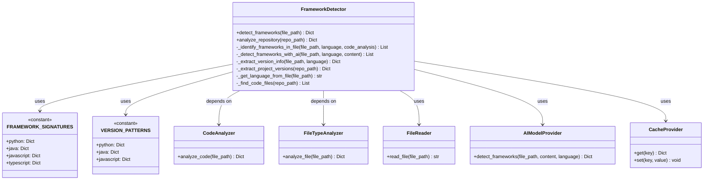
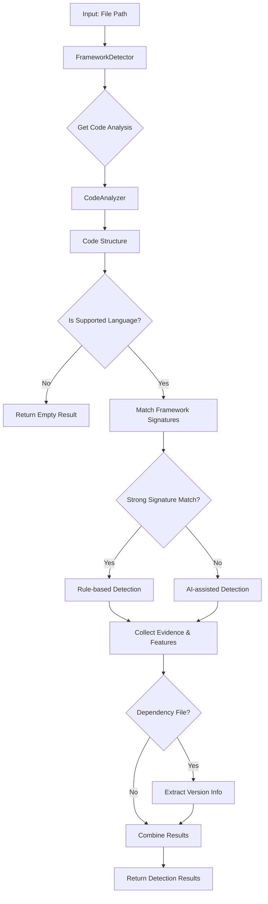
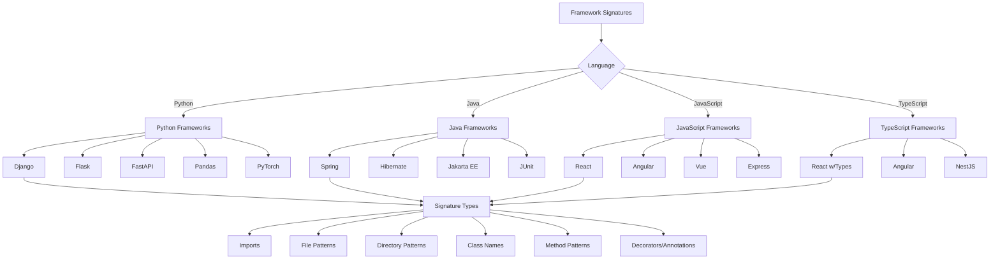
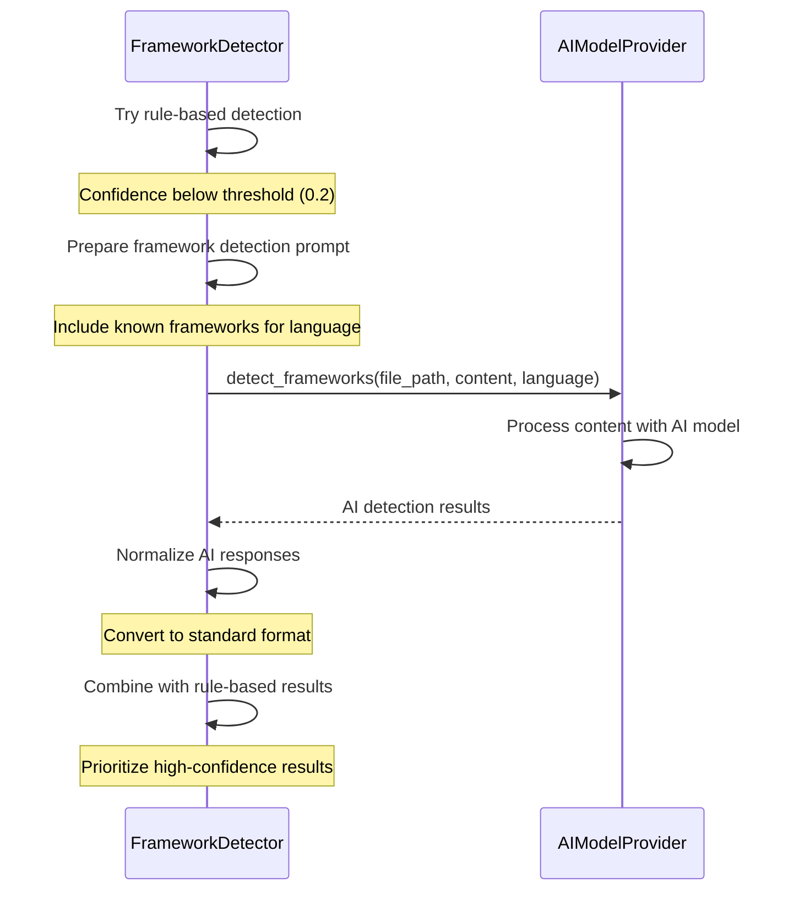
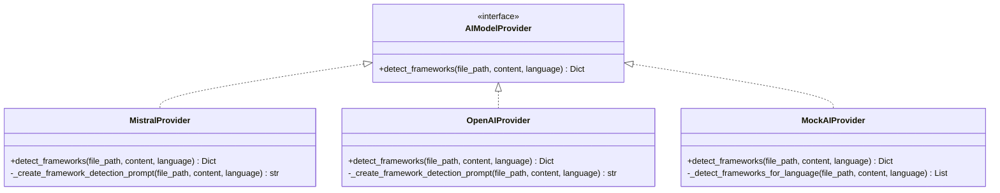
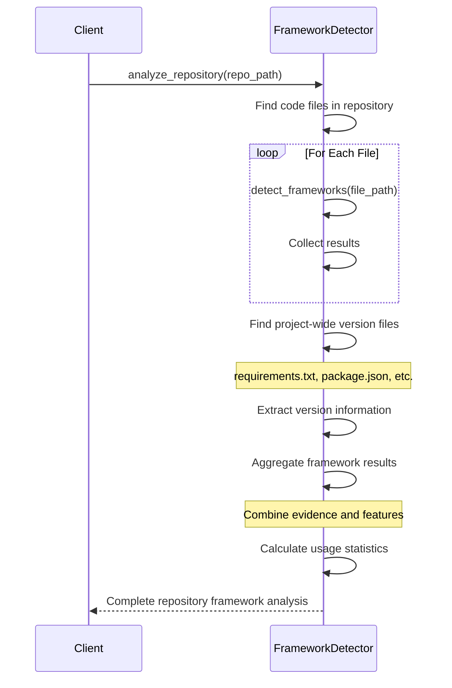
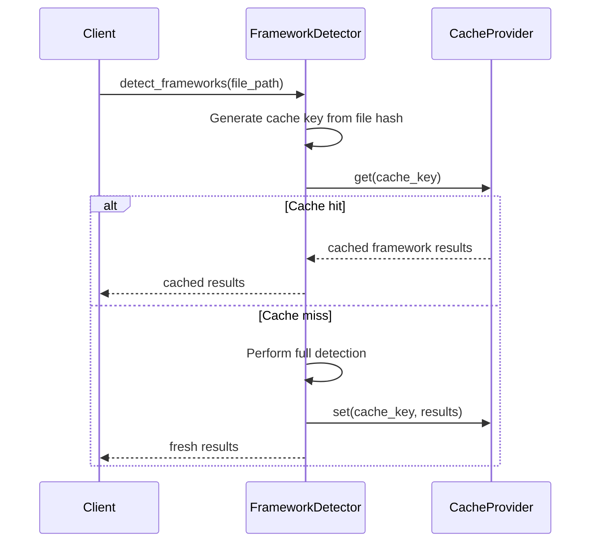
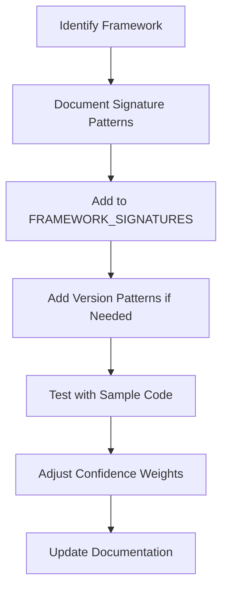
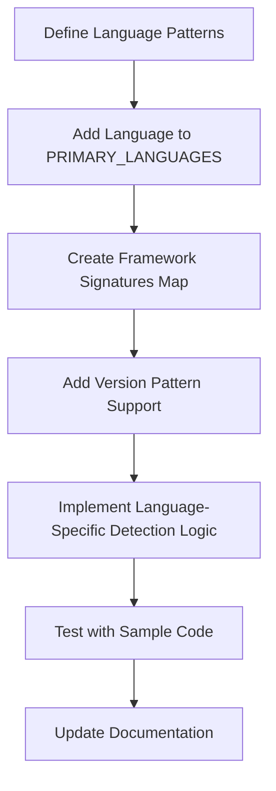
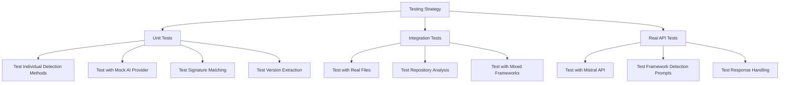

# Framework Detection System Design

This document provides a detailed design overview of the Framework Detection system, which identifies frameworks and libraries used in code repositories.

## 1. Introduction

The Framework Detection system is designed to identify programming frameworks and libraries used in source code across multiple languages. It uses a hybrid approach combining rule-based signature matching with AI-assisted analysis to provide comprehensive, accurate detection with high confidence.

### 1.1 Purpose and Goals

The primary purpose of the Framework Detection system is to:

1. Identify which frameworks and libraries are used in a codebase
2. Determine which versions of these frameworks are in use
3. Analyze how frameworks are being used within the code
4. Provide confidence scores for each detection
5. Support the documentation generation process

These capabilities help developers understand codebases more quickly and generate more accurate documentation.

## 2. System Architecture

### 2.1 Component Diagram



### 2.2 Data Flow Diagram



## 3. Rule-Based Detection

### 3.1 Framework Signatures Structure

The system uses a comprehensive set of signatures to identify frameworks through pattern matching:



### 3.2 Example Signature (Django)

```python
"django": {
    "imports": ["django", "from django"],
    "files": ["settings.py", "urls.py", "wsgi.py", "asgi.py"],
    "directories": ["migrations"],
    "classes": ["Model", "Form", "View", "Admin", "Migration"],
    "decorators": ["@admin.register", "@receiver", "@login_required"]
}
```

### 3.3 Version Detection

The system extracts version information from dependency files using regular expression patterns:

```mermaid
graph TD
    A[Version Detection] --> B{File Type}
    
    B -->|requirements.txt| C["Python: r'(?P<framework>[\\w-]+)==(?P<version>[\\d\\.]+)'"]
    B -->|setup.py| D["Python: r'install_requires=\\[.*?[\\'\\"](?P<framework>[\\w-]+)[\\'\\"].*?(?P<version>[\\d\\.]+)'"]
    B -->|pyproject.toml| E["Python: r'(?P<framework>[\\w-]+)\\s*=\\s*[\\'\\"](?P<version>[\\d\\.]+)[\\'\\"]'"]
    
    B -->|pom.xml| F["Java: r'<dependency>.*?<groupId>(?P<framework>[\\w\\.-]+)</groupId>.*?<version>(?P<version>[\\w\\.-]+)</version>'"]
    B -->|build.gradle| G["Java: r'implementation\\s+[\\'\\"](?P<framework>[\\w\\.-]+):(?P<module>[\\w\\.-]+):(?P<version>[\\w\\.-]+)[\\'\\"]'"]
    
    B -->|package.json| H["JavaScript: r'\"(?P<framework>[\\w\\.-]+)\":\\s*\"(?P<version>[\\^~><]?[\\d\\.]+)\"'"]
```

## 4. AI-Assisted Detection

### 4.1 Detection Flow

When rule-based detection doesn't provide strong matches or for complex frameworks, the system falls back to AI-assisted detection:



### 4.2 Provider-Specific Implementations



## 5. Repository-Wide Analysis

### 5.1 Analysis Process

The Framework Detector can analyze entire repositories to provide a comprehensive view of framework usage:



### 5.2 Repository Results Structure

```
{
    "repo_path": "/path/to/repo",
    "frameworks": [
        {
            "name": "django",
            "language": "python",
            "version": "3.2.4",
            "confidence": 0.95,
            "count": 15,
            "usage": [
                {
                    "file_path": "/path/to/models.py",
                    "features": ["models.Model", "migrations"]
                },
                {
                    "file_path": "/path/to/views.py",
                    "features": ["HttpResponse", "TemplateView"]
                }
            ]
        },
        {
            "name": "react",
            "language": "javascript",
            "version": "17.0.2",
            "confidence": 0.9,
            "count": 8,
            "usage": [...]
        }
    ],
    "file_results": {...},
    "statistics": {
        "total_files_analyzed": 45,
        "frameworks_detected": 5,
        "languages": {"python": 20, "javascript": 25},
        "detection_time": 1.5
    }
}
```

## 6. Performance Considerations

### 6.1 Caching Strategy



### 6.2 Processing Optimizations

1. **Early Filtering**:
   - Skip files that aren't likely to contain framework information
   - Prioritize key files like imports and configuration

2. **Content Limiting**:
   - For AI analysis, only send the most relevant parts of large files
   - Analyze imports and structural elements first

3. **Confidence Thresholds**:
   - Use fast rule-based checks first
   - Only fall back to AI analysis when necessary

4. **Framework-Aware Priorities**:
   - Prioritize checking for frameworks commonly used in the detected language
   - Skip checks for frameworks incompatible with the language

## 7. Extension Points

### 7.1 Adding New Frameworks

To add support for a new framework:



Example implementation:

```python
# Add to FRAMEWORK_SIGNATURES
FRAMEWORK_SIGNATURES["python"]["new_framework"] = {
    "imports": ["new_framework", "from new_framework"],
    "patterns": ["NewFrameworkClass", "special_function"],
    "decorators": ["@new_framework.decorator"]
}

# Add to VERSION_PATTERNS if needed
VERSION_PATTERNS["python"]["new_requirement_file.txt"] = r'new_framework[>=](?P<version>[\d\.]+)'
```

### 7.2 Adding New Languages

To add support for a new programming language:



Example implementation:

```python
# Add to PRIMARY_LANGUAGES in code_analyzer.py
PRIMARY_LANGUAGES.append("new_language")

# Add language signatures
FRAMEWORK_SIGNATURES["new_language"] = {
    "framework1": {
        "imports": ["framework1"],
        "patterns": ["FrameworkClass"],
        # ...additional signatures
    }
}

# Add version patterns
VERSION_PATTERNS["new_language"] = {
    "dependency_file.ext": r'pattern_to_extract_version'
}
```

## 8. Testing Strategy

### 8.1 Testing Approach



### 8.2 Key Test Cases

1. **Single Framework Detection**:
   - Test detection of each supported framework individually
   - Verify correct evidence and feature extraction

2. **Mixed Framework Detection**:
   - Test files using multiple frameworks together
   - Verify all frameworks are detected with appropriate confidence

3. **Version Extraction**:
   - Test extraction from various dependency file formats
   - Test with different version formats (semantic versioning, ranges, etc.)

4. **AI Fallback**:
   - Test cases where rule-based detection fails
   - Verify AI provider is called and results are processed correctly

5. **Repository Analysis**:
   - Test with mock repositories containing mixed frameworks
   - Verify statistics and aggregation logic

## 9. Usage Examples

### 9.1 Detecting Frameworks in a Single File

```python
# Create a framework detector
detector = FrameworkDetector(
    ai_provider=MistralProvider(api_key="your_key"),
    cache_provider=InMemoryCache()
)

# Detect frameworks in a file
result = detector.detect_frameworks("path/to/file.py")
print(f"Detected frameworks: {[f['name'] for f in result['frameworks']]}")
```

### 9.2 Analyzing an Entire Repository

```python
# Create a framework detector
detector = FrameworkDetector(
    ai_provider=MistralProvider(api_key="your_key"),
    cache_provider=InMemoryCache()
)

# Analyze entire repository
repo_result = detector.analyze_repository("path/to/repo")

# Display framework usage
for framework in repo_result["frameworks"]:
    print(f"{framework['name']} ({framework['version']}): Used in {framework['count']} files")
    print(f"  Confidence: {framework['confidence']}")
    print(f"  Features: {set(f for usage in framework['usage'] for f in usage['features'])}")
```

### 9.3 Integration with Documentation Generation

```python
# Analyze repository for frameworks
frameworks = detector.analyze_repository("path/to/repo")["frameworks"]

# Generate framework documentation section
doc = ["## Frameworks and Libraries\n"]
for framework in frameworks:
    doc.append(f"### {framework['name']} (v{framework['version']})")
    doc.append(f"**Language**: {framework['language']}")
    doc.append(f"**Usage**: Found in {framework['count']} files")
    
    # List key features
    features = set(f for usage in framework['usage'] for f in usage['features'])
    doc.append("\n**Key Components Used**:")
    for feature in features:
        doc.append(f"- {feature}")
    
    doc.append("\n")

# Write documentation
with open("framework_documentation.md", "w") as f:
    f.write("\n".join(doc))
```

## 10. Conclusion

The Framework Detection system is a powerful component that provides valuable insights into the frameworks and libraries used in a codebase. Its hybrid approach combining rule-based detection with AI-assisted analysis ensures high accuracy while maintaining performance.

Key strengths of the system include:

1. **Comprehensive Detection**: Supports multiple languages and frameworks
2. **Accurate Version Information**: Extracts version data from dependency files
3. **Detailed Usage Analysis**: Identifies how frameworks are being used
4. **Repository-Wide View**: Provides a holistic view of framework usage
5. **Extensible Design**: Easy to add support for new frameworks and languages

This system forms a critical part of the overall code analysis and documentation generation process, enabling more complete and accurate understanding of codebases.