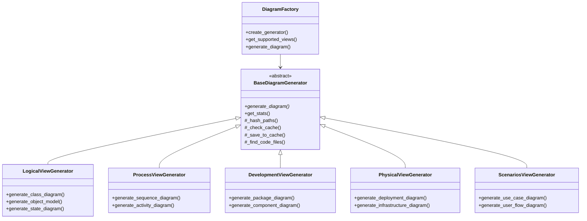

# Feature Design: Physical and Scenarios View Diagrams

## 1. Overview

This feature completes our UML diagram generation system by adding the remaining two views from the 4+1 architectural view model: Physical View and Scenarios View. These views provide critical insights into the system's deployment characteristics and key use case behaviors.

## 2. Diagram Types

### 2.1 Physical View Diagrams
- **Deployment Diagrams**: Show hardware nodes, artifacts, and execution environments
- **Infrastructure Diagrams**: Visualize cloud resources, servers, and network connections

### 2.2 Scenarios View Diagrams
- **Use Case Diagrams**: Illustrate system functionality from the user's perspective
- **User Flow Diagrams**: Visualize end-to-end user interactions with the system

## 3. Architecture Design

Following our established SOLID principles and consistent with the existing diagram generators, we'll implement this feature as follows:



## 4. Key Design Considerations

### 4.1 Deployment Diagram Generation
Deployment diagrams are unique in that they often need to extract information beyond just the code, such as:

1. Docker/container configurations
2. Environment configuration files
3. CI/CD pipeline definitions
4. Infrastructure-as-code files (Terraform, CloudFormation, etc.)

The challenge is to synthesize these diverse sources into a coherent deployment diagram.

### 4.2 Use Case Diagram Generation
Use case diagrams represent functional requirements and user interactions, often documented in:

1. Documentation files
2. README and markdown files
3. Test files (especially integration and end-to-end tests)
4. Route definitions in web applications
5. API endpoint definitions

The generator will need to extract this information to identify actors, use cases, and their relationships.

## 5. Implementation Approach

### 5.1 PhysicalViewGenerator Implementation

```python
class PhysicalViewGenerator(BaseDiagramGenerator):
    """
    Generates UML Physical View diagrams for code repositories.
    
    Creates deployment diagrams and infrastructure diagrams using Mermaid syntax
    based on deployment configuration files and infrastructure definitions.
    """
    
    def generate_deployment_diagram(self, repo_path, title="Deployment Diagram"):
        """
        Generate a deployment diagram showing nodes, artifacts, and execution environments.
        
        Steps:
        1. Analyze Docker, Kubernetes, and other deployment configuration files
        2. Identify hardware nodes and execution environments
        3. Map software artifacts to nodes
        4. Determine communication paths between nodes
        5. Generate Mermaid diagram syntax
        """
        pass
        
    def generate_infrastructure_diagram(self, repo_path, title="Infrastructure Diagram"):
        """
        Generate an infrastructure diagram showing cloud resources and connections.
        
        Steps:
        1. Analyze IaC files (Terraform, CloudFormation, etc.)
        2. Identify infrastructure components (servers, databases, networks)
        3. Determine relationships between components
        4. Generate Mermaid diagram syntax
        """
        pass
```

### 5.2 ScenariosViewGenerator Implementation

```python
class ScenariosViewGenerator(BaseDiagramGenerator):
    """
    Generates UML Scenarios View diagrams for code repositories.
    
    Creates use case diagrams and user flow diagrams using Mermaid syntax
    based on extracted requirements and user interactions.
    """
    
    def generate_use_case_diagram(self, repo_path, title="Use Case Diagram"):
        """
        Generate a use case diagram showing actors and their interactions.
        
        Steps:
        1. Analyze documentation, tests, and routes/endpoints
        2. Identify actors (users, external systems)
        3. Extract use cases (system functions)
        4. Determine relationships between actors and use cases
        5. Generate Mermaid diagram syntax
        """
        pass
        
    def generate_user_flow_diagram(self, repo_path, use_case=None, title="User Flow Diagram"):
        """
        Generate a user flow diagram for a specific use case.
        
        Steps:
        1. Analyze test files, especially UI/integration tests
        2. Extract user interaction sequences
        3. Map steps to system responses
        4. Generate Mermaid diagram syntax
        """
        pass
```

## 6. Diagram Factory Updates

The existing `DiagramFactory` will need to be updated to support the new view types:

```python
def get_supported_views(self):
    """
    Get information about supported views and diagram types.
    """
    return {
        "logical": {
            "class": "Class relationship diagrams showing static structure",
            "object": "Object diagram showing instances and relationships",
            "state": "State diagram showing state transitions"
        },
        "process": {
            "sequence": "Sequence diagram showing object interactions over time",
            "activity": "Activity diagram showing control flow of a process"
        },
        "development": {
            "package": "Package diagram showing code organization",
            "component": "Component diagram showing logical components and interfaces"
        },
        "physical": {
            "deployment": "Deployment diagram showing hardware nodes and artifacts",
            "infrastructure": "Infrastructure diagram showing cloud resources and servers"
        },
        "scenarios": {
            "use_case": "Use case diagram showing system functionality",
            "user_flow": "User flow diagram showing user interactions"
        }
    }

def create_generator(self, view_type):
    """
    Create a diagram generator for the specified view type.
    """
    # Existing view types...
    elif view_type == "physical":
        generator = PhysicalViewGenerator(
            ai_provider=self.ai_provider,
            code_analyzer=self.code_analyzer,
            file_reader=self.file_reader,
            file_hasher=self.file_hasher,
            cache_provider=self.cache_provider
        )
    elif view_type == "scenarios":
        generator = ScenariosViewGenerator(
            ai_provider=self.ai_provider,
            code_analyzer=self.code_analyzer,
            file_reader=self.file_reader,
            file_hasher=self.file_hasher,
            cache_provider=self.cache_provider
        )
    else:
        raise ValueError(f"Unsupported view type: {view_type}")
```

## 7. Integration with AI Analysis

The AI model will be instrumental in extracting semantically meaningful information from diverse sources. For example:

### 7.1 Deployment Diagram AI Analysis Prompt

```
Analyze the following deployment configuration files and extract information about hardware nodes, 
execution environments, and deployed artifacts:

```DEPLOYMENT_FILES_CONTENT```

Identify:
1. Hardware nodes (servers, devices)
2. Execution environments (containers, VMs, runtimes)
3. Artifacts deployed to each environment
4. Communication paths between nodes
5. Dependencies between artifacts

Format your response as a structured JSON object with nodes, artifacts, and connections.
```

### 7.2 Use Case Diagram AI Analysis Prompt

```
Analyze the following files to identify system actors, use cases, and their interactions:

```DOCUMENTATION_AND_TEST_FILES```

Identify:
1. External actors (users, systems) that interact with the system
2. Primary use cases (system functions)
3. Relationships between actors and use cases
4. Inclusions and extensions between use cases

Format your response as a structured JSON object with actors, use cases, and relationships.
```

## 8. Example Outputs

### 8.1 Deployment Diagram (Mermaid)

```
graph TD
    subgraph Cloud
        subgraph "Production Environment"
            API[API Server]
            WEB[Web Server]
            DB[(Database)]
            CACHE[(Cache)]
        end
    end
    
    subgraph Client
        BROWSER[Web Browser]
        MOBILE[Mobile App]
    end
    
    BROWSER -->|HTTPS| WEB
    MOBILE -->|REST| API
    WEB -->|Internal HTTP| API
    API -->|TCP/IP| DB
    API -->|Redis| CACHE
```

### 8.2 Use Case Diagram (Mermaid)

```
graph TD
    User((User))
    Admin((Admin))
    System((External System))
    
    UC1[Login]
    UC2[Search Files]
    UC3[Upload File]
    UC4[Download File]
    UC5[Manage Users]
    UC6[Sync Data]
    
    User --> UC1
    User --> UC2
    User --> UC3
    User --> UC4
    
    Admin --> UC1
    Admin --> UC5
    
    System --> UC6
    
    UC3 -.-> UC2
```

## 9. Implementation Plan

1. Create PhysicalViewGenerator class:
   - Implement deployment diagram generation
   - Implement infrastructure diagram generation
   - Add appropriate test coverage

2. Create ScenariosViewGenerator class:
   - Implement use case diagram generation
   - Implement user flow diagram generation
   - Add appropriate test coverage

3. Update DiagramFactory:
   - Add support for the new generators
   - Extend supported views mapping

4. Update documentation:
   - Document new diagram types
   - Provide usage examples

## 10. Testing Approach

1. Unit tests for each generator method
2. Integration tests with sample repositories containing:
   - Docker and Kubernetes files
   - Infrastructure-as-code definitions
   - Test files and documentation
3. AI provider mocks for predictable testing
4. Verification of diagram syntax correctness

## 11. Future Enhancements

1. Support for additional deployment technologies (Nomad, Swarm, etc.)
2. Enhanced cloud service visualization (AWS, Azure, GCP specific resources)
3. Integration with external documentation systems
4. User flow animation or interactive diagrams
5. Integration with requirements management systems