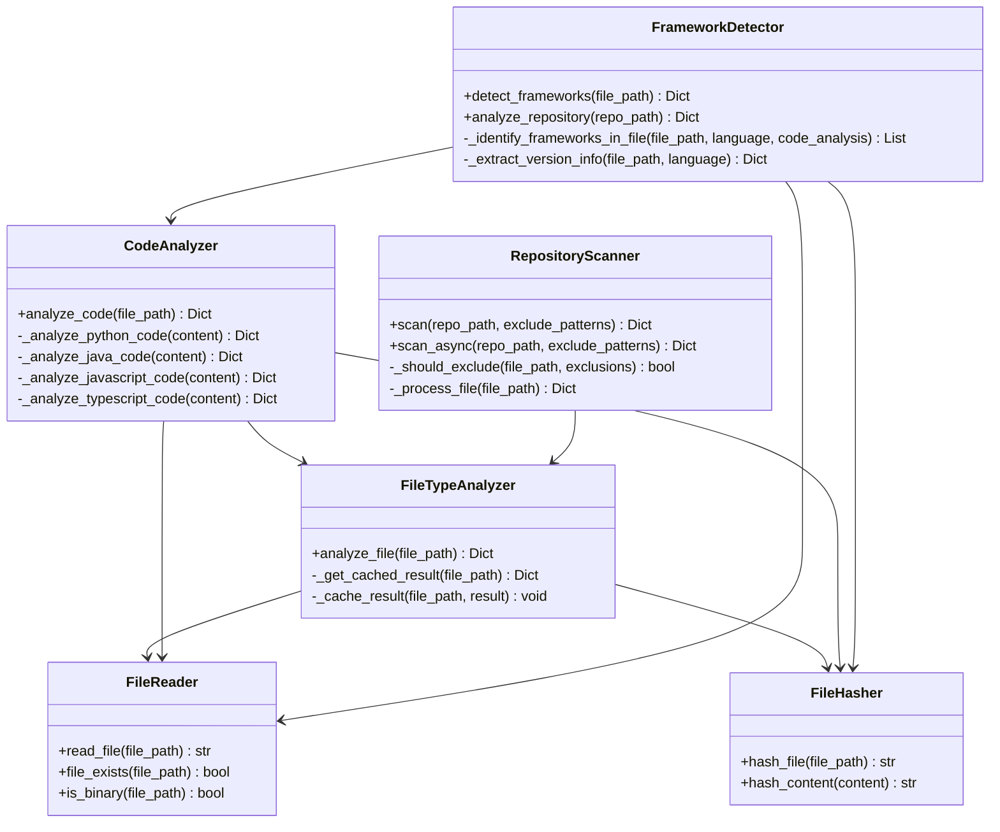
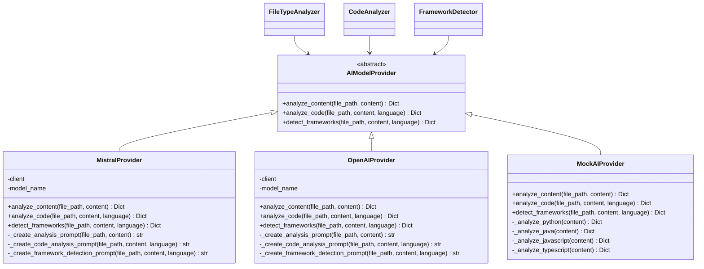
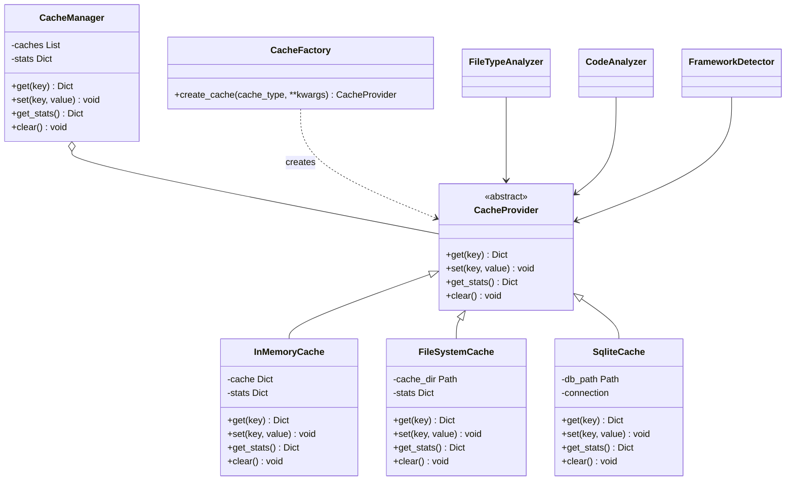
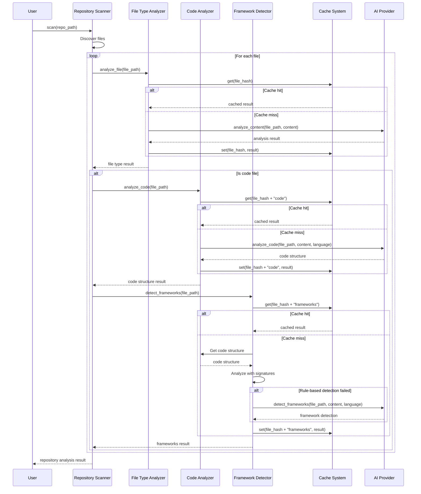
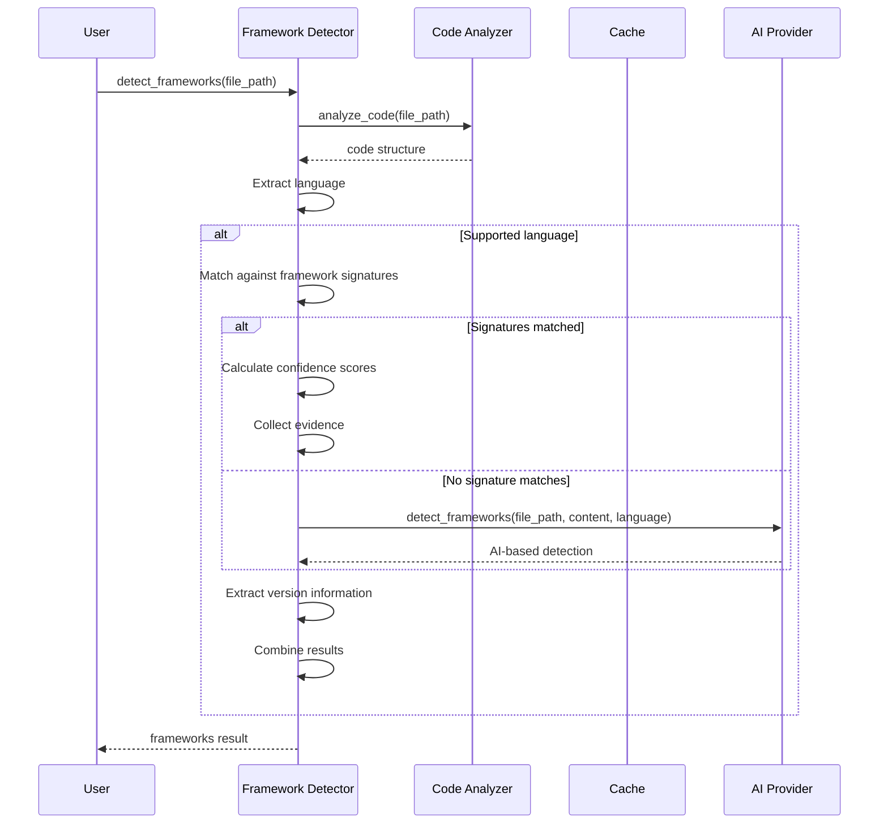

# System Architecture and Design Documentation

## 1. Introduction

This document provides a comprehensive overview of the File Analyzer system architecture. The system is designed to analyze code repositories to extract detailed information about file types, programming languages, frameworks, and code structure. This information is then used to generate documentation that gives a clear understanding of the codebase without requiring manual documentation efforts.

## 2. Design Goals

The system is built with the following design goals:

1. **Modularity**: Components have clear, single responsibilities and can be developed, tested, and maintained independently.
2. **Extensibility**: The system can be easily extended to support new languages, frameworks, and analysis capabilities.
3. **Performance**: Caching and efficient algorithms ensure the system can handle large repositories.
4. **Accuracy**: AI models combined with rule-based approaches provide high-quality analysis.
5. **Resource Efficiency**: Intelligent caching reduces API calls and computational resources.

## 3. System Overview

The File Analyzer system consists of several major components that work together to analyze code repositories:

1. **File Type Analyzer**: Identifies file types, languages, and purposes.
2. **Code Analyzer**: Extracts detailed code structure from identified source files.
3. **Framework Detector**: Identifies frameworks and libraries used in the codebase.
4. **Repository Scanner**: Traverses repositories and coordinates analysis of files.
5. **AI Providers**: Interface with AI models to perform analysis.
6. **Cache System**: Stores analysis results to improve performance and reduce API calls.

## 4. Component Architecture

### 4.1 Core Components

### 4.2 AI Provider Components

### 4.3 Cache Components

## 5. Key Workflows

### 5.1 Repository Analysis Workflow

### 5.2 Framework Detection Workflow

## 6. Key Design Patterns

The system implements several important design patterns:

1. **Strategy Pattern**: Different AI providers implement the same interface but provide different strategies for analysis.

2. **Factory Pattern**: The CacheFactory creates appropriate cache implementations based on configuration.

3. **Composite Pattern**: The CacheManager combines multiple cache providers into a unified interface.

4. **Adapter Pattern**: AI providers adapt external AI APIs to the internal system interface.

5. **Builder Pattern**: Analysis results are constructed incrementally by different components.

6. **Chain of Responsibility**: Analysis flows from file type detection to code analysis to framework detection.

## 7. Extension Points

The system is designed with several extension points:

1. **New AI Providers**: Implement the AIModelProvider interface to add support for additional AI models.

2. **Additional Languages**: Extend the code analyzer with support for new programming languages.

3. **New Frameworks**: Add signature patterns to the framework detector for additional frameworks.

4. **Cache Backends**: Implement the CacheProvider interface to add new caching strategies.

5. **Analysis Capabilities**: Each analysis component can be extended with new capabilities.

## 8. Implementation Considerations

### 8.1 Performance Optimizations

- **Multi-level Caching**: Combines fast in-memory caching with persistent storage.
- **Concurrent Processing**: Repository scanner supports asynchronous file processing.
- **Selective Analysis**: Only analyzes files that need detailed inspection.
- **Chunking**: Large files are processed in chunks to optimize AI model usage.

### 8.2 Error Handling

- **Graceful Degradation**: If AI analysis fails, the system falls back to simpler methods.
- **Comprehensive Logging**: All errors are logged with appropriate context.
- **Recovery Mechanisms**: Temporary failures trigger retry attempts.

## 9. Deployment Considerations

### 9.1 Dependencies

- **AI Model Access**: Requires API keys for the selected AI provider.
- **Python Environment**: Python 3.8+ with appropriate packages.
- **Storage**: Sufficient disk space for caching analysis results.

### 9.2 Configuration

- **Cache Settings**: Can be configured for different environments.
- **AI Provider Selection**: Different providers can be selected based on needs.
- **Exclusion Patterns**: Can be configured to skip certain files or directories.

## 10. Future Directions

1. **Additional Languages**: Support for more programming languages.
2. **Improved Analysis**: Enhanced AI prompts for more accurate analysis.
3. **Documentation Generation**: Direct generation of documentation from analysis results.
4. **Visualization**: Generate diagrams and visualizations of the codebase.
5. **Integration**: Integration with development tools and CI/CD pipelines.

## 11. Conclusion

The File Analyzer system provides a robust, extensible architecture for analyzing code repositories. Its modular design, use of AI, and comprehensive caching strategies enable efficient and accurate analysis of complex codebases, providing valuable insights for documentation and understanding.