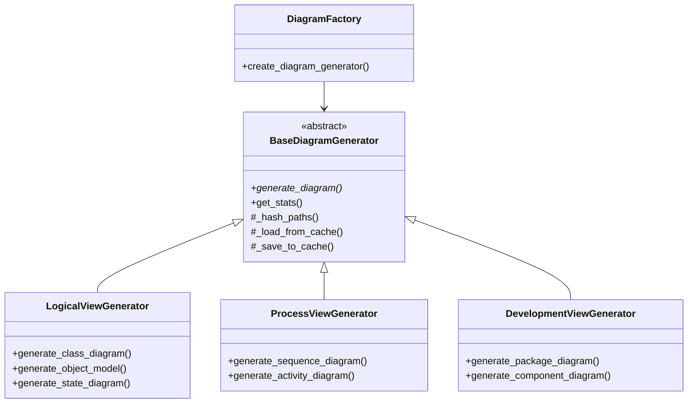
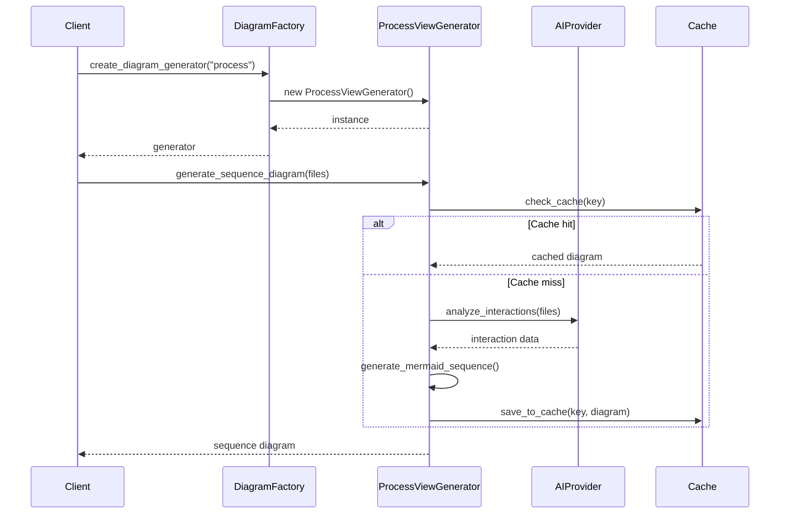

# Feature Design: Process and Development View Diagrams

## 1. Overview

This feature extends our UML diagram generation system to include Process View and Development View diagrams, which are essential parts of the 4+1 architectural view model. These diagrams provide crucial information about system dynamics (how components interact) and system structure (how code is organized).

## 2. Diagram Types

### 2.1 Process View Diagrams
- **Sequence Diagrams**: Show object interactions over time
- **Activity Diagrams**: Represent business processes and algorithm flows

### 2.2 Development View Diagrams
- **Package Diagrams**: Show code organization and dependencies
- **Component Diagrams**: Visualize high-level components and interfaces

## 3. Architecture Design

Following SOLID principles, we'll implement this feature as follows:



## 4. Implementation Approach

### 4.1 Single Responsibility Principle
- Each diagram generator class has a single responsibility (generating specific diagram types)
- `ProcessViewGenerator` focuses only on behavioral diagrams
- `DevelopmentViewGenerator` focuses only on structural organization diagrams

### 4.2 Open/Closed Principle
- The base diagram generator is open for extension but closed for modification
- New diagram types can be added without changing existing code

### 4.3 Liskov Substitution Principle
- All diagram generators can be used interchangeably through their base class interface
- Common operations (caching, stats) work consistently across all generators

### 4.4 Interface Segregation Principle
- Specific methods for diagram generation only exist in classes that need them
- Common behavior is encapsulated in the base class

### 4.5 Dependency Inversion Principle
- All generators depend on abstractions (interfaces) rather than concrete implementations
- External dependencies (AI provider, cache, etc.) are injected through constructors

## 5. Sequence Diagram Generation



## 6. Technical Implementation Details

### 6.1 Sequence Diagram Generation
```python
def generate_sequence_diagram(self, file_paths, main_method=None):
    # 1. Identify entry points (if main_method not specified)
    # 2. Trace method calls and interactions
    # 3. Build sequence of interactions
    # 4. Generate Mermaid syntax
    # 5. Return diagram data
```

### 6.2 Package Diagram Generation
```python
def generate_package_diagram(self, directory, depth=2):
    # 1. Analyze directory structure
    # 2. Identify package dependencies
    # 3. Build hierarchical package structure
    # 4. Generate Mermaid syntax
    # 5. Return diagram data
```

## 7. Integration with Existing Systems

- Integrate with existing caching system
- Reuse AI provider interfaces
- Leverage existing relationship data
- Maintain consistent styling with Logical View diagrams

## 8. Example Output

### 8.1 Sequence Diagram (Mermaid)
```
sequenceDiagram
    participant User
    participant Controller
    participant Service
    participant Database
    
    User->>Controller: request()
    activate Controller
    Controller->>Service: processRequest()
    activate Service
    Service->>Database: query()
    activate Database
    Database-->>Service: results
    deactivate Database
    Service-->>Controller: response
    deactivate Service
    Controller-->>User: render()
    deactivate Controller
```

### 8.2 Package Diagram (Mermaid)
```
graph TD
    subgraph project
        subgraph src
            A[models]
            B[controllers]
            C[services]
            D[utils]
        end
        subgraph test
            E[unit]
            F[integration]
        end
    end
    
    B-->A
    B-->C
    C-->A
    C-->D
    E-->A
    E-->C
    F-->B
```

## 9. Implementation Status

1. ✅ Created base abstract `BaseDiagramGenerator` class
   - Implemented caching, file utilities, and common statistics tracking
   - Added abstract `generate_diagram()` method for all subclasses to implement

2. ✅ Refactored `LogicalViewGenerator` to extend base class
   - Implemented class, object, and state diagram generators
   - Added support for combined repository-wide diagrams

3. ✅ Implemented `ProcessViewGenerator` for behavioral diagrams
   - Added sequence diagram generation with method call tracing
   - Added activity diagram generation with AI-assisted control flow analysis
   - Implemented fallback diagrams when AI analysis is unavailable

4. ✅ Implemented `DevelopmentViewGenerator` for structural diagrams
   - Added package diagram generation based on directory structure analysis 
   - Added component diagram generation with interface detection
   - Implemented dependency tracking between components

5. ✅ Created `DiagramFactory` for instantiating appropriate generators
   - Implemented factory pattern with generator caching
   - Added view type validation and generator selection

6. ✅ Added comprehensive tests
   - Unit tests for each generator type
   - Mock-based testing to avoid external dependencies
   - Coverage for main diagram generation methods

This implementation follows SOLID principles and provides a clean, extensible architecture for UML diagram generation. The system can be further extended to support additional diagram types in the future.