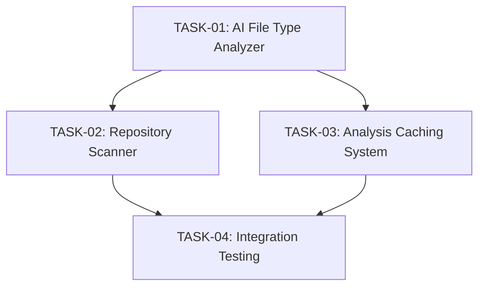

# Engineering Tasks for File Type Detection

This file summarizes the engineering tasks required to implement the [File Type Detection](01-file-type-detection.md) user story using an AI-based approach.

## Tasks Overview

| Task ID | Task Name | Estimated Effort | Priority | Status | Dependencies |
|---------|-----------|------------------|----------|--------|--------------|
| REPO-01-TASK-01 | [AI File Type Analyzer](tasks/TASK-01-ai-file-type-analyzer.md) | 8 hours | High | Not Started | None |
| REPO-01-TASK-02 | [Repository Scanner](tasks/TASK-02-repository-scanner.md) | 8 hours | High | Not Started | TASK-01 |
| REPO-01-TASK-03 | [Analysis Caching System](tasks/TASK-03-analysis-caching-system.md) | 4 hours | Medium | Not Started | TASK-01 |
| REPO-01-TASK-04 | [Integration Testing](tasks/TASK-04-integration-testing.md) | 4 hours | Medium | Not Started | TASK-01, TASK-02, TASK-03 |
| **Total** | | **24 hours** | | | |

## Task Dependencies Diagram

## Implementation Approach

The implementation will follow these key principles:

1. **AI-First Analysis**: Leverage AI models to identify file types, languages, and purposes without creating custom parsers for each language.

2. **Efficient Resource Usage**: Implement caching and smart batching to minimize API costs and optimize performance.

3. **Scalable Processing**: Design the system to handle repositories of any size through batching and prioritization.

4. **Graceful Degradation**: Implement fallbacks and error handling to ensure the system works reliably even with API limitations.

## Acceptance Testing

The completion of this user story will be validated when:

1. The system can correctly identify diverse file types specified in the PRD
2. File analysis is performed within acceptable time limits
3. The system efficiently handles repositories of various sizes
4. All integration tests pass