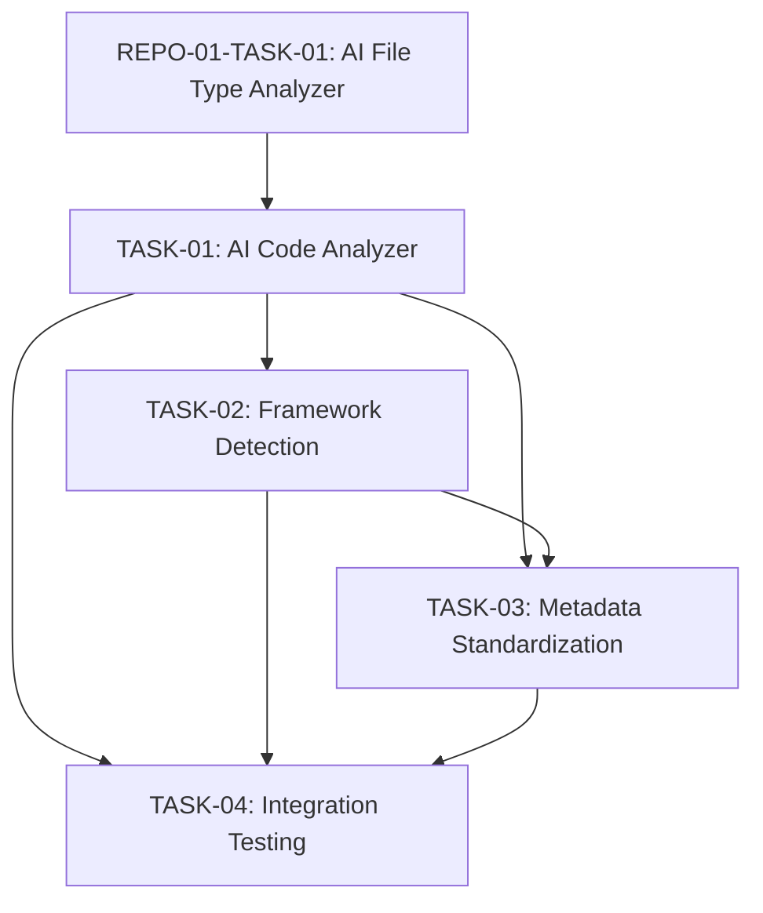

# Engineering Tasks for Primary Language Support

This file summarizes the engineering tasks required to implement the [Primary Language Support](02-language-support-primary.md) user story using an AI-based approach.

## Tasks Overview

| Task ID | Task Name | Estimated Effort | Priority | Status | Dependencies |
|---------|-----------|------------------|----------|--------|--------------|
| REPO-02-TASK-01 | [AI Code Analyzer](tasks/TASK-01-ai-code-analyzer.md) | 8 hours | High | Not Started | REPO-01-TASK-01 |
| REPO-02-TASK-02 | [Framework Detection](tasks/TASK-02-framework-detection.md) | 6 hours | Medium | Not Started | TASK-01 |
| REPO-02-TASK-03 | [Metadata Standardization](tasks/TASK-03-metadata-standardization.md) | 6 hours | High | Not Started | TASK-01, TASK-02 |
| REPO-02-TASK-04 | [Integration Testing](tasks/TASK-04-integration-testing.md) | 4 hours | Medium | Not Started | TASK-01, TASK-02, TASK-03 |
| **Total** | | **24 hours** | | | |

## Task Dependencies Diagram

## Implementation Approach

The implementation will follow these key principles:

1. **AI-Based Analysis**: Leverage AI models to analyze code structure, relationships, and documentation without building language-specific parsers.

2. **Language Agnostic Design**: Create standardized metadata formats that work across all languages while preserving important language-specific details.

3. **Framework Context**: Enhance code analysis with framework detection to provide better context and understanding.

4. **Scalable Processing**: Design the system to handle codebases of any size through efficient chunking and batching strategies.

## Acceptance Testing

The completion of this user story will be validated when:

1. The system can analyze code in all primary languages (Python, Java, JavaScript/TypeScript)
2. Code analysis correctly identifies structural elements and relationships
3. Framework detection properly identifies common frameworks in use
4. Metadata is properly standardized across languages
5. All integration tests pass