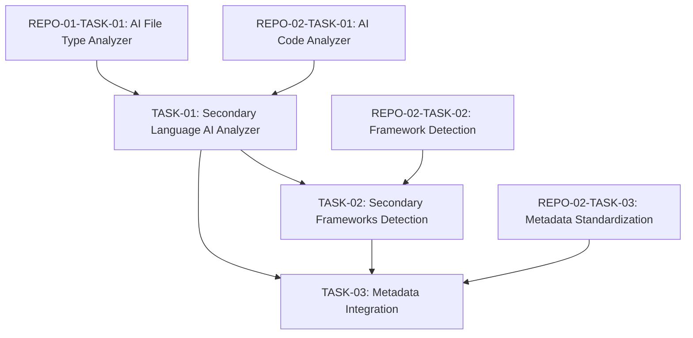

# Engineering Tasks for Secondary Language Support

This file summarizes the engineering tasks required to implement the [Secondary Language Support](03-language-support-secondary.md) user story using an AI-based approach.

## Tasks Overview

| Task ID | Task Name | Estimated Effort | Priority | Status | Dependencies |
|---------|-----------|------------------|----------|--------|--------------|
| REPO-03-TASK-01 | [Secondary Language AI Analyzer](tasks/TASK-01-secondary-language-ai-analyzer.md) | 12 hours | Medium | Not Started | REPO-01-TASK-01, REPO-02-TASK-01 |
| REPO-03-TASK-02 | [Secondary Frameworks Detection](tasks/TASK-02-secondary-frameworks-detection.md) | 8 hours | Medium | Not Started | TASK-01, REPO-02-TASK-02 |
| REPO-03-TASK-03 | [Metadata Integration](tasks/TASK-03-metadata-integration.md) | 6 hours | Medium | Not Started | TASK-01, TASK-02, REPO-02-TASK-03 |
| **Total** | | **26 hours** | | | |

## Task Dependencies Diagram

## Implementation Approach

The implementation will follow these key principles:

1. **Extended AI Analysis**: Adapt the AI-based approach used for primary languages to work with the more diverse and complex secondary languages.

2. **Unified Metadata**: Ensure metadata from all languages can be integrated into a consistent schema while preserving language-specific details.

3. **Framework Context**: Enhance code analysis with framework detection for secondary languages to provide better context for documentation.

4. **Incremental Implementation**: Prioritize the most commonly used secondary languages first, with support for others added incrementally.

## Acceptance Testing

The completion of this user story will be validated when:

1. The system can analyze code in all specified secondary languages
2. Code analysis correctly identifies structural elements and relationships in secondary languages
3. Framework detection properly identifies common frameworks in secondary languages
4. Metadata from secondary languages integrates seamlessly with the standardized schema
5. Documentation generated from secondary language analysis is consistent with primary language documentation