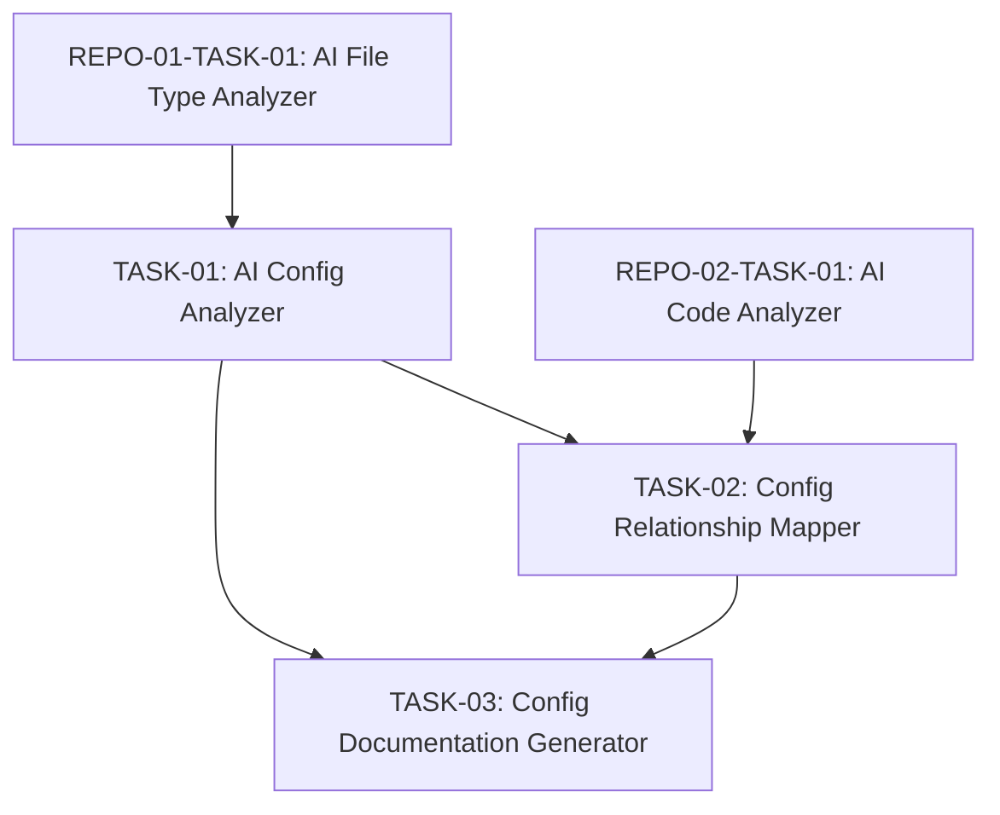

# Engineering Tasks for Config File Analysis

This file summarizes the engineering tasks required to implement the [Config File Analysis](04-config-file-analysis.md) user story using an AI-based approach.

## Tasks Overview

| Task ID | Task Name | Estimated Effort | Priority | Status | Dependencies |
|---------|-----------|------------------|----------|--------|--------------|
| REPO-04-TASK-01 | [AI Config Analyzer](tasks/TASK-01-ai-config-analyzer.md) | 8 hours | High | Not Started | REPO-01-TASK-01 |
| REPO-04-TASK-02 | [Config Relationship Mapper](tasks/TASK-02-config-relationship-mapper.md) | 6 hours | Medium | Not Started | TASK-01, REPO-02-TASK-01 |
| REPO-04-TASK-03 | [Config Documentation Generator](tasks/TASK-03-config-documentation-generator.md) | 4 hours | Medium | Not Started | TASK-01, TASK-02 |
| **Total** | | **18 hours** | | | |

## Task Dependencies Diagram

## Implementation Approach

The implementation will follow these key principles:

1. **AI-Driven Analysis**: Leverage AI models to understand configuration files of various formats and extract structured information.

2. **Contextual Understanding**: Connect configuration files to their usage in code to provide comprehensive documentation.

3. **Security Awareness**: Identify potential security issues in configuration, such as hardcoded credentials or insecure defaults.

4. **Deployment Focus**: Generate documentation that helps with system deployment and configuration across environments.

## Acceptance Testing

The completion of this user story will be validated when:

1. The system can analyze various configuration file formats (JSON, YAML, XML, properties, env)
2. Analysis correctly identifies parameters, their types, and constraints
3. Documentation includes usage context and relationships to code
4. Security concerns in configuration are identified
5. Generated documentation provides clear guidance for system configuration and deployment