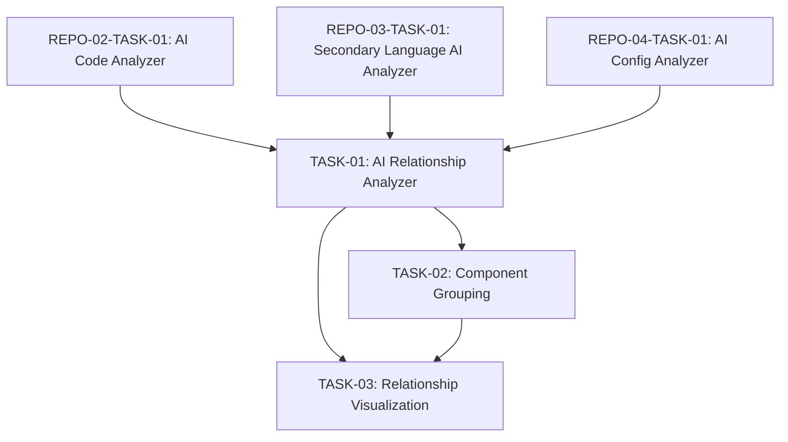

# Engineering Tasks for Relationship Mapping

This file summarizes the engineering tasks required to implement the [Relationship Mapping](05-relationship-mapping.md) user story using an AI-based approach.

## Tasks Overview

| Task ID | Task Name | Estimated Effort | Priority | Status | Dependencies |
|---------|-----------|------------------|----------|--------|--------------|
| REPO-05-TASK-01 | [AI Relationship Analyzer](tasks/TASK-01-ai-relationship-analyzer.md) | 10 hours | Medium | Not Started | REPO-02-TASK-01, REPO-03-TASK-01, REPO-04-TASK-01 |
| REPO-05-TASK-02 | [Component Grouping](tasks/TASK-02-component-grouping.md) | 6 hours | Medium | Not Started | TASK-01 |
| REPO-05-TASK-03 | [Relationship Visualization](tasks/TASK-03-relationship-visualization.md) | 6 hours | Medium | Not Started | TASK-01, TASK-02 |
| **Total** | | **22 hours** | | | |

## Task Dependencies Diagram

## Implementation Approach

The implementation will follow these key principles:

1. **AI-Driven Analysis**: Use AI to identify relationships between components across different languages and file types.

2. **Hierarchical Understanding**: Group components into modules and subsystems to provide higher-level architectural insights.

3. **Multiple Views**: Generate visualizations that capture different aspects of the system architecture following the UML 4+1 View Model.

4. **Scalable Visualization**: Handle complex codebases through appropriate clustering and detail management in diagrams.

## Acceptance Testing

The completion of this user story will be validated when:

1. The system can identify relationships between components across different languages
2. Component grouping provides meaningful architectural insights
3. Generated visualizations follow the UML 4+1 View Model
4. Diagrams are clear and readable even for complex systems
5. Visualizations accurately represent the system architecture