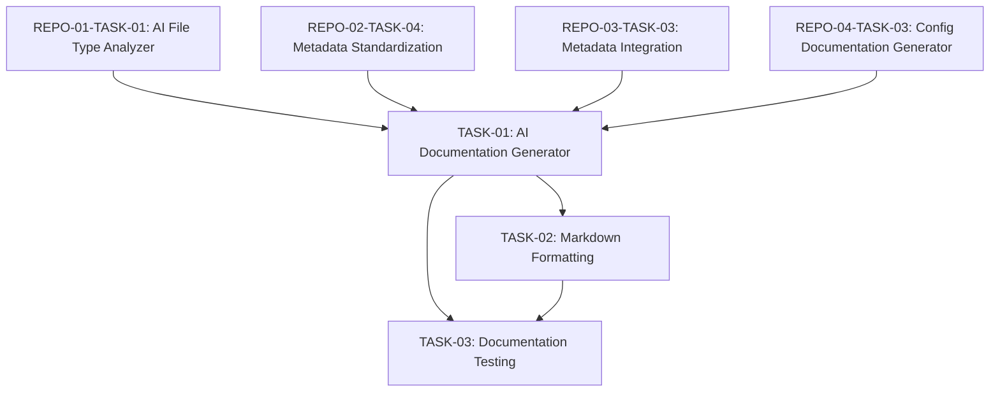

# Engineering Tasks for File Metadata Documentation

This file summarizes the engineering tasks required to implement the [File Metadata Documentation](01-file-metadata-documentation.md) user story using an AI-based approach.

## Tasks Overview

| Task ID | Task Name | Estimated Effort | Priority | Status | Dependencies |
|---------|-----------|------------------|----------|--------|--------------|
| DOC-01-TASK-01 | [AI Documentation Generator](tasks/TASK-01-ai-documentation-generator.md) | 8 hours | High | Not Started | REPO-01-TASK-01, REPO-02-TASK-04, REPO-03-TASK-03, REPO-04-TASK-03 |
| DOC-01-TASK-02 | [Markdown Formatting](tasks/TASK-02-markdown-formatting.md) | 4 hours | Medium | Not Started | TASK-01 |
| DOC-01-TASK-03 | [Documentation Testing](tasks/TASK-03-documentation-testing.md) | 4 hours | Medium | Not Started | TASK-01, TASK-02 |
| **Total** | | **16 hours** | | | |

## Task Dependencies Diagram

## Implementation Approach

The implementation will follow these key principles:

1. **AI-Enhanced Documentation**: Use AI to transform raw metadata into clear, readable documentation with rich context and examples.

2. **Consistent Formatting**: Apply uniform Markdown formatting across all documentation to ensure readability and proper rendering.

3. **Quality Assurance**: Implement testing to verify documentation completeness, accuracy, and formatting to maintain high quality standards.

4. **Developer Focus**: Create documentation that answers the key questions developers have when working with unfamiliar code.

## Acceptance Testing

The completion of this user story will be validated when:

1. The system generates comprehensive documentation for diverse file types
2. Documentation is consistently formatted in clean, readable Markdown
3. Generated documentation includes all required sections for each file type
4. Cross-references and links between files work correctly
5. Documentation passes all quality and formatting tests