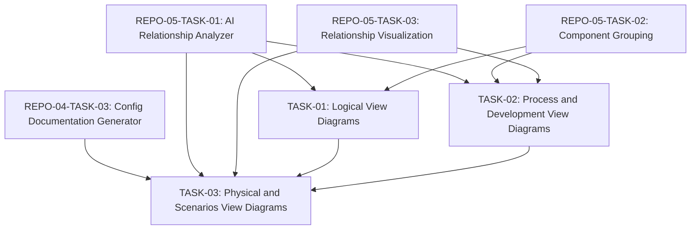

# Engineering Tasks for UML Diagram Generation

This file summarizes the engineering tasks required to implement the [UML Diagram Generation](02-uml-diagram-generation.md) user story using an AI-based approach.

## Tasks Overview

| Task ID | Task Name | Estimated Effort | Priority | Status | Dependencies |
|---------|-----------|------------------|----------|--------|--------------|
| DOC-02-TASK-01 | [Logical View Diagrams](tasks/TASK-01-logical-view-diagrams.md) | 6 hours | High | Not Started | REPO-05-TASK-01, REPO-05-TASK-02 |
| DOC-02-TASK-02 | [Process and Development View Diagrams](tasks/TASK-02-process-development-views.md) | 6 hours | Medium | Not Started | REPO-05-TASK-01, REPO-05-TASK-02, REPO-05-TASK-03 |
| DOC-02-TASK-03 | [Physical and Scenarios View Diagrams](tasks/TASK-03-physical-scenarios-views.md) | 6 hours | Medium | Not Started | REPO-04-TASK-03, REPO-05-TASK-01, REPO-05-TASK-03, TASK-01, TASK-02 |
| **Total** | | **18 hours** | | | |

## Task Dependencies Diagram

## Implementation Approach

The implementation will follow these key principles:

1. **Complete 4+1 View Model**: Generate all five views of the UML 4+1 Model to provide comprehensive system documentation.

2. **AI-Enhanced Diagramming**: Use AI to identify which diagrams are most important and what level of detail is appropriate.

3. **Consistency and Style**: Maintain consistent styling and layout across all diagram types for professional documentation.

4. **Appropriate Detail**: Balance completeness with readability by including appropriate levels of detail for different context levels.

## Acceptance Testing

The completion of this user story will be validated when:

1. The system generates all diagram types specified in the UML 4+1 View Model
2. Diagrams correctly represent the system structure, behavior, and deployment
3. Generated diagrams use consistent styling and are readable
4. PlantUML or Mermaid syntax is valid and renders correctly
5. Diagrams provide value for understanding the system architecture from multiple perspectives