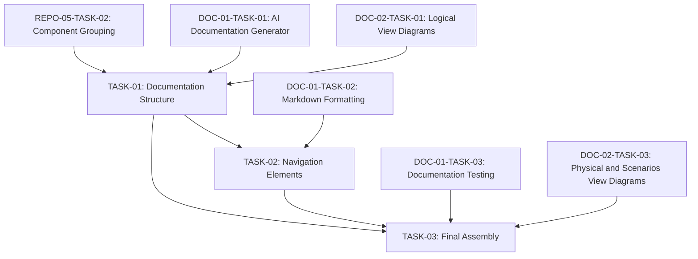

# Engineering Tasks for Documentation Organization

This file summarizes the engineering tasks required to implement the [Documentation Organization](03-documentation-organization.md) user story using an AI-based approach.

## Tasks Overview

| Task ID | Task Name | Estimated Effort | Priority | Status | Dependencies |
|---------|-----------|------------------|----------|--------|--------------|
| DOC-03-TASK-01 | [Documentation Structure](tasks/TASK-01-documentation-structure.md) | 6 hours | High | Not Started | REPO-05-TASK-02, DOC-01-TASK-01, DOC-02-TASK-01 |
| DOC-03-TASK-02 | [Navigation Elements](tasks/TASK-02-navigation-elements.md) | 4 hours | Medium | Not Started | TASK-01, DOC-01-TASK-02 |
| DOC-03-TASK-03 | [Final Assembly](tasks/TASK-03-final-assembly.md) | 4 hours | Medium | Not Started | TASK-01, TASK-02, DOC-01-TASK-03, DOC-02-TASK-03 |
| **Total** | | **14 hours** | | | |

## Task Dependencies Diagram

## Implementation Approach

The implementation will follow these key principles:

1. **Logical Organization**: Structure documentation to reflect the logical organization of the codebase for intuitive navigation.

2. **Comprehensive Navigation**: Provide multiple navigation paths through the documentation to support different user needs and exploration styles.

3. **Complete Integration**: Assemble all documentation components into a cohesive, self-contained package with consistent styling and navigation.

4. **User-Centric Design**: Organize documentation with the user's needs in mind, making it easy to find specific information and understand the overall system.

## Acceptance Testing

The completion of this user story will be validated when:

1. Documentation is organized in a clear, logical structure that reflects the codebase
2. Navigation elements (TOC, breadcrumbs, links) allow easy movement through the documentation
3. All documentation components are properly integrated into the final package
4. Internal links and cross-references are correctly resolved
5. Documentation is complete, cohesive, and ready for use